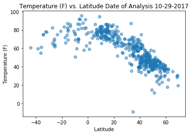
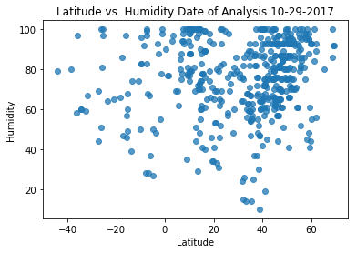
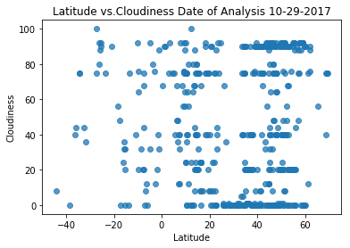
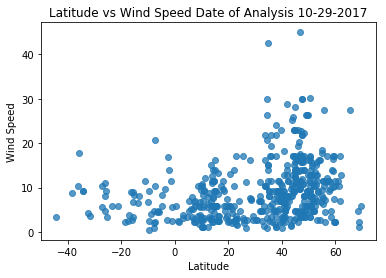

# WeatherPy

The objective of this project was to analyze the effect of latitude on the following weather variables: temperature, humidity, cloudiness, and wind speed. To get the 500 randomly selected cities I used a CSV file from the Citypy Python library Github repository and the sample method. Once I had my 500 randomly selected zip codes, I pulled weather data for those locations from the Open Weather API. I then used this data to generate scatter plots using Matplotlib to analyze the correlation between latitude and the afore mentioned weather variables. These are the key insights I found:


## Analysis

1. There is a relatively strong correlation bewteen latitude and temperature. The lower 
   latitudes have higher temperatures and the higher latitudes have lower temperatures.
2. The correlation between humidity and latitude is very weak.
3. There is almost no correlation between cloudiness and latitude.
4. The correlation between latitude and wind speed is very weak.
5. Although my sample was random, there was a bias toward cities in the northern 
   hemisphere in my sample. Most of the cities in my sample were located in Europe.


```python
#Dependencies

import pandas as pd
import matplotlib.pyplot as plt
import seaborn
from citipy import citipy
import random
import csv
import requests
import time
```


```python
api_key = "accafea3e20973ac585a55cc17b7c084"
```


```python
#Import CSV file, and read into DataFrame.

world_data = pd.read_csv("resources/worldcities.csv")

#Preview the data.
world_data.head()
```


<div>
<style>
    .dataframe thead tr:only-child th {
        text-align: right;
    }

    .dataframe thead th {
        text-align: left;
    }

    .dataframe tbody tr th {
        vertical-align: top;
    }
</style>
<table border="1" class="dataframe">
  <thead>
    <tr style="text-align: right;">
      <th></th>
      <th>Country</th>
      <th>City</th>
      <th>Latitude</th>
      <th>Longitude</th>
    </tr>
  </thead>
  <tbody>
    <tr>
      <th>0</th>
      <td>ad</td>
      <td>andorra la vella</td>
      <td>42.500000</td>
      <td>1.516667</td>
    </tr>
    <tr>
      <th>1</th>
      <td>ad</td>
      <td>canillo</td>
      <td>42.566667</td>
      <td>1.600000</td>
    </tr>
    <tr>
      <th>2</th>
      <td>ad</td>
      <td>encamp</td>
      <td>42.533333</td>
      <td>1.583333</td>
    </tr>
    <tr>
      <th>3</th>
      <td>ad</td>
      <td>la massana</td>
      <td>42.550000</td>
      <td>1.516667</td>
    </tr>
    <tr>
      <th>4</th>
      <td>ad</td>
      <td>les escaldes</td>
      <td>42.500000</td>
      <td>1.533333</td>
    </tr>
  </tbody>
</table>
</div>


```python
# Randomly select 500 cities for weather data.

selected_cities = world_data.sample(n=500)

#Visualize the selected cities DataFrame.

selected_cities
```


<div>
<style>
    .dataframe thead tr:only-child th {
        text-align: right;
    }

    .dataframe thead th {
        text-align: left;
    }

    .dataframe tbody tr th {
        vertical-align: top;
    }
</style>
<table border="1" class="dataframe">
  <thead>
    <tr style="text-align: right;">
      <th></th>
      <th>Country</th>
      <th>City</th>
      <th>Latitude</th>
      <th>Longitude</th>
    </tr>
  </thead>
  <tbody>
    <tr>
      <th>43104</th>
      <td>us</td>
      <td>north decatur</td>
      <td>33.790278</td>
      <td>-84.306111</td>
    </tr>
    <tr>
      <th>8490</th>
      <td>de</td>
      <td>bad doberan</td>
      <td>54.100000</td>
      <td>11.900000</td>
    </tr>
    <tr>
      <th>1822</th>
      <td>be</td>
      <td>wetteren</td>
      <td>51.000000</td>
      <td>3.883333</td>
    </tr>
    <tr>
      <th>42176</th>
      <td>us</td>
      <td>siloam springs</td>
      <td>36.188056</td>
      <td>-94.540278</td>
    </tr>
    <tr>
      <th>43099</th>
      <td>us</td>
      <td>monroe</td>
      <td>33.794722</td>
      <td>-83.713333</td>
    </tr>
    <tr>
      <th>30471</th>
      <td>ph</td>
      <td>tibiao</td>
      <td>11.291515</td>
      <td>122.035407</td>
    </tr>
    <tr>
      <th>25623</th>
      <td>nl</td>
      <td>neede</td>
      <td>52.135118</td>
      <td>6.611966</td>
    </tr>
    <tr>
      <th>20572</th>
      <td>it</td>
      <td>maniago</td>
      <td>46.170556</td>
      <td>12.707778</td>
    </tr>
    <tr>
      <th>12861</th>
      <td>gb</td>
      <td>portgordon</td>
      <td>57.650000</td>
      <td>-3.016667</td>
    </tr>
    <tr>
      <th>1543</th>
      <td>be</td>
      <td>hensies</td>
      <td>50.433333</td>
      <td>3.666667</td>
    </tr>
    <tr>
      <th>17085</th>
      <td>in</td>
      <td>banapur</td>
      <td>19.783333</td>
      <td>85.183333</td>
    </tr>
    <tr>
      <th>2056</th>
      <td>bg</td>
      <td>simeonovgrad</td>
      <td>42.033333</td>
      <td>25.833333</td>
    </tr>
    <tr>
      <th>22238</th>
      <td>kz</td>
      <td>zhitikara</td>
      <td>52.190833</td>
      <td>61.200556</td>
    </tr>
    <tr>
      <th>12107</th>
      <td>fr</td>
      <td>toulouse</td>
      <td>43.599516</td>
      <td>1.433188</td>
    </tr>
    <tr>
      <th>30818</th>
      <td>pk</td>
      <td>kamoke</td>
      <td>31.974444</td>
      <td>74.224444</td>
    </tr>
    <tr>
      <th>16659</th>
      <td>ie</td>
      <td>kilcullen</td>
      <td>53.130278</td>
      <td>-6.744444</td>
    </tr>
    <tr>
      <th>30356</th>
      <td>ph</td>
      <td>talaibon</td>
      <td>13.837800</td>
      <td>121.139800</td>
    </tr>
    <tr>
      <th>27911</th>
      <td>ph</td>
      <td>claver</td>
      <td>9.574900</td>
      <td>125.730700</td>
    </tr>
    <tr>
      <th>46327</th>
      <td>ve</td>
      <td>el tigre</td>
      <td>8.892500</td>
      <td>-64.252778</td>
    </tr>
    <tr>
      <th>28282</th>
      <td>ph</td>
      <td>hilotongan</td>
      <td>11.144000</td>
      <td>123.642600</td>
    </tr>
    <tr>
      <th>45006</th>
      <td>us</td>
      <td>columbus</td>
      <td>39.961111</td>
      <td>-82.998889</td>
    </tr>
    <tr>
      <th>13847</th>
      <td>gr</td>
      <td>lianoveryion</td>
      <td>40.637778</td>
      <td>22.503056</td>
    </tr>
    <tr>
      <th>15884</th>
      <td>hu</td>
      <td>ostoros</td>
      <td>47.866667</td>
      <td>20.433333</td>
    </tr>
    <tr>
      <th>36829</th>
      <td>ru</td>
      <td>lisiy nos</td>
      <td>60.016856</td>
      <td>30.020082</td>
    </tr>
    <tr>
      <th>17616</th>
      <td>in</td>
      <td>dondaicha</td>
      <td>21.333333</td>
      <td>74.566667</td>
    </tr>
    <tr>
      <th>14606</th>
      <td>gt</td>
      <td>san jose del golfo</td>
      <td>14.762778</td>
      <td>-90.376389</td>
    </tr>
    <tr>
      <th>3311</th>
      <td>br</td>
      <td>manaira</td>
      <td>-7.700000</td>
      <td>-38.166667</td>
    </tr>
    <tr>
      <th>46023</th>
      <td>us</td>
      <td>mukilteo</td>
      <td>47.944722</td>
      <td>-122.303333</td>
    </tr>
    <tr>
      <th>35111</th>
      <td>ru</td>
      <td>aleksandrovsk</td>
      <td>59.158043</td>
      <td>57.562414</td>
    </tr>
    <tr>
      <th>29210</th>
      <td>ph</td>
      <td>namboongan</td>
      <td>16.303300</td>
      <td>120.375800</td>
    </tr>
    <tr>
      <th>...</th>
      <td>...</td>
      <td>...</td>
      <td>...</td>
      <td>...</td>
    </tr>
    <tr>
      <th>43795</th>
      <td>us</td>
      <td>mays chapel</td>
      <td>39.433056</td>
      <td>-76.649722</td>
    </tr>
    <tr>
      <th>22376</th>
      <td>lt</td>
      <td>jonava</td>
      <td>55.083333</td>
      <td>24.283333</td>
    </tr>
    <tr>
      <th>3151</th>
      <td>br</td>
      <td>ituacu</td>
      <td>-13.816667</td>
      <td>-41.300000</td>
    </tr>
    <tr>
      <th>28290</th>
      <td>ph</td>
      <td>hingatungan</td>
      <td>10.584000</td>
      <td>125.185200</td>
    </tr>
    <tr>
      <th>14487</th>
      <td>gt</td>
      <td>guazacapan</td>
      <td>14.074167</td>
      <td>-90.416667</td>
    </tr>
    <tr>
      <th>45918</th>
      <td>us</td>
      <td>hampton</td>
      <td>37.029722</td>
      <td>-76.345556</td>
    </tr>
    <tr>
      <th>31616</th>
      <td>pt</td>
      <td>godim</td>
      <td>41.171037</td>
      <td>-7.803033</td>
    </tr>
    <tr>
      <th>35624</th>
      <td>ru</td>
      <td>chernyshkovskiy</td>
      <td>48.421875</td>
      <td>42.230825</td>
    </tr>
    <tr>
      <th>12248</th>
      <td>gb</td>
      <td>annbank</td>
      <td>55.466667</td>
      <td>-4.516667</td>
    </tr>
    <tr>
      <th>26725</th>
      <td>pe</td>
      <td>pacanga</td>
      <td>-7.166667</td>
      <td>-79.500000</td>
    </tr>
    <tr>
      <th>30825</th>
      <td>pk</td>
      <td>kashmor</td>
      <td>28.433333</td>
      <td>69.583333</td>
    </tr>
    <tr>
      <th>32946</th>
      <td>ro</td>
      <td>draganesti de vede</td>
      <td>44.133333</td>
      <td>25.050000</td>
    </tr>
    <tr>
      <th>43313</th>
      <td>us</td>
      <td>marion</td>
      <td>37.730556</td>
      <td>-88.933056</td>
    </tr>
    <tr>
      <th>2434</th>
      <td>br</td>
      <td>barcarena</td>
      <td>-1.500000</td>
      <td>-48.666667</td>
    </tr>
    <tr>
      <th>41354</th>
      <td>ua</td>
      <td>kirove</td>
      <td>47.653107</td>
      <td>35.695120</td>
    </tr>
    <tr>
      <th>15867</th>
      <td>hu</td>
      <td>ocseny</td>
      <td>46.313697</td>
      <td>18.757493</td>
    </tr>
    <tr>
      <th>24849</th>
      <td>mx</td>
      <td>villachuato</td>
      <td>20.166667</td>
      <td>-101.583333</td>
    </tr>
    <tr>
      <th>37915</th>
      <td>ru</td>
      <td>rtishchevo</td>
      <td>52.260412</td>
      <td>43.787450</td>
    </tr>
    <tr>
      <th>3265</th>
      <td>br</td>
      <td>laranjeiras do sul</td>
      <td>-25.416667</td>
      <td>-52.416667</td>
    </tr>
    <tr>
      <th>35734</th>
      <td>ru</td>
      <td>donskoye</td>
      <td>52.774946</td>
      <td>41.477586</td>
    </tr>
    <tr>
      <th>44727</th>
      <td>us</td>
      <td>east northport</td>
      <td>40.876667</td>
      <td>-73.325000</td>
    </tr>
    <tr>
      <th>20003</th>
      <td>ir</td>
      <td>tonekabon</td>
      <td>36.816259</td>
      <td>50.873763</td>
    </tr>
    <tr>
      <th>27457</th>
      <td>ph</td>
      <td>binubusan</td>
      <td>13.962826</td>
      <td>120.637713</td>
    </tr>
    <tr>
      <th>45978</th>
      <td>us</td>
      <td>burien</td>
      <td>47.470556</td>
      <td>-122.345556</td>
    </tr>
    <tr>
      <th>24858</th>
      <td>mx</td>
      <td>villa juarez</td>
      <td>22.116667</td>
      <td>-102.066667</td>
    </tr>
    <tr>
      <th>17510</th>
      <td>in</td>
      <td>datia</td>
      <td>25.666667</td>
      <td>78.466667</td>
    </tr>
    <tr>
      <th>38177</th>
      <td>ru</td>
      <td>sim</td>
      <td>54.993000</td>
      <td>57.698200</td>
    </tr>
    <tr>
      <th>10219</th>
      <td>dm</td>
      <td>coulihaut</td>
      <td>15.483333</td>
      <td>-61.483333</td>
    </tr>
    <tr>
      <th>4078</th>
      <td>br</td>
      <td>sorocaba</td>
      <td>-23.483333</td>
      <td>-47.450000</td>
    </tr>
    <tr>
      <th>38297</th>
      <td>ru</td>
      <td>sovkhoznyy</td>
      <td>56.559900</td>
      <td>61.426000</td>
    </tr>
  </tbody>
</table>
<p>500 rows × 4 columns</p>
</div>


```python
#Counter

row_count = 0

# Create blank columns for the necessary fields.

selected_cities["Temperature"] = ""
selected_cities["Humidity"] = ""
selected_cities["Cloudiness"] = ""
selected_cities["Wind Speed"] = ""

# Loop through and get the weather data using the Open Weather API.

for index, row in selected_cities.iterrows():
    #Sleep to help with the call limit
    
    time.sleep(1)
    
    #Open weather url.
    
    url = "https://api.openweathermap.org/data/2.5/weather?"
    units = "Imperial"
    
    query_url = url + "lat="+ str(row["Latitude"]) + "&lon=" + str(row["Longitude"]) + "&appid=" + api_key + "&units=" + units
    #Print log to ensure the loop is working correctly.
    
    print("Now retieving city # " + str(row_count))
    print(query_url)
    row_count += 1
    
    #Run requests to grab the JSON at the requested URL
    
    city_weather = requests.get(query_url).json()
    
    
    #print(row["Latitude"],row["Longitude"])
#print(city_weather.keys())
    
    #Append the weather data to the appropriate columns.
    #Use try/except to skip any cities with errors.
    #selected_cities.append(requests.get(query_url + str(city_weather)).json())
    try:
        temperature = city_weather["main"]["temp"]
        humidity = city_weather["main"]["humidity"]
        cloudiness = city_weather["clouds"]["all"]
        wind_speed = city_weather["wind"]["speed"]
        
        selected_cities.set_value(index, "Temperature", temperature)
        selected_cities.set_value(index,"Humidity", humidity)
        selected_cities.set_value(index,"Cloudiness", cloudiness)
        selected_cities.set_value(index,"Wind Speed", wind_speed)
    except:
        print("Error with weather data, skipping.")
        #continue
selected_cities  
```

    Now retieving city # 0
    https://api.openweathermap.org/data/2.5/weather?lat=33.7902778&lon=-84.3061111&appid=accafea3e20973ac585a55cc17b7c084&units=Imperial
    Now retieving city # 1
    https://api.openweathermap.org/data/2.5/weather?lat=54.1&lon=11.9&appid=accafea3e20973ac585a55cc17b7c084&units=Imperial
    Now retieving city # 2
    https://api.openweathermap.org/data/2.5/weather?lat=51.0&lon=3.8833330000000004&appid=accafea3e20973ac585a55cc17b7c084&units=Imperial
    Now retieving city # 3
    https://api.openweathermap.org/data/2.5/weather?lat=36.188055600000006&lon=-94.5402778&appid=accafea3e20973ac585a55cc17b7c084&units=Imperial
    Now retieving city # 4
    https://api.openweathermap.org/data/2.5/weather?lat=33.7947222&lon=-83.7133333&appid=accafea3e20973ac585a55cc17b7c084&units=Imperial
    Now retieving city # 5
    https://api.openweathermap.org/data/2.5/weather?lat=11.291514999999999&lon=122.035407&appid=accafea3e20973ac585a55cc17b7c084&units=Imperial
    Now retieving city # 6
    https://api.openweathermap.org/data/2.5/weather?lat=52.135118&lon=6.611966000000001&appid=accafea3e20973ac585a55cc17b7c084&units=Imperial
    Now retieving city # 7
    https://api.openweathermap.org/data/2.5/weather?lat=46.170556&lon=12.707778&appid=accafea3e20973ac585a55cc17b7c084&units=Imperial
    Now retieving city # 8
    https://api.openweathermap.org/data/2.5/weather?lat=57.65&lon=-3.016667&appid=accafea3e20973ac585a55cc17b7c084&units=Imperial
    Now retieving city # 9
    https://api.openweathermap.org/data/2.5/weather?lat=50.433333000000005&lon=3.666667&appid=accafea3e20973ac585a55cc17b7c084&units=Imperial
    Now retieving city # 10
    https://api.openweathermap.org/data/2.5/weather?lat=19.783333&lon=85.18333299999999&appid=accafea3e20973ac585a55cc17b7c084&units=Imperial
    Now retieving city # 11
    https://api.openweathermap.org/data/2.5/weather?lat=42.033333299999995&lon=25.8333333&appid=accafea3e20973ac585a55cc17b7c084&units=Imperial
    Now retieving city # 12
    https://api.openweathermap.org/data/2.5/weather?lat=52.190833000000005&lon=61.200556000000006&appid=accafea3e20973ac585a55cc17b7c084&units=Imperial
    Now retieving city # 13
    https://api.openweathermap.org/data/2.5/weather?lat=43.599515999999994&lon=1.433188&appid=accafea3e20973ac585a55cc17b7c084&units=Imperial
    Now retieving city # 14
    https://api.openweathermap.org/data/2.5/weather?lat=31.974444000000002&lon=74.22444399999999&appid=accafea3e20973ac585a55cc17b7c084&units=Imperial
    Now retieving city # 15
    https://api.openweathermap.org/data/2.5/weather?lat=53.130277799999995&lon=-6.7444444&appid=accafea3e20973ac585a55cc17b7c084&units=Imperial
    Now retieving city # 16
    https://api.openweathermap.org/data/2.5/weather?lat=13.8378&lon=121.1398&appid=accafea3e20973ac585a55cc17b7c084&units=Imperial
    Now retieving city # 17
    https://api.openweathermap.org/data/2.5/weather?lat=9.5749&lon=125.7307&appid=accafea3e20973ac585a55cc17b7c084&units=Imperial
    Now retieving city # 18
    https://api.openweathermap.org/data/2.5/weather?lat=8.8925&lon=-64.25277779999999&appid=accafea3e20973ac585a55cc17b7c084&units=Imperial
    Now retieving city # 19
    https://api.openweathermap.org/data/2.5/weather?lat=11.144&lon=123.6426&appid=accafea3e20973ac585a55cc17b7c084&units=Imperial
    Now retieving city # 20
    https://api.openweathermap.org/data/2.5/weather?lat=39.961111100000004&lon=-82.99888890000001&appid=accafea3e20973ac585a55cc17b7c084&units=Imperial
    Now retieving city # 21
    https://api.openweathermap.org/data/2.5/weather?lat=40.6377778&lon=22.5030556&appid=accafea3e20973ac585a55cc17b7c084&units=Imperial
    Now retieving city # 22
    https://api.openweathermap.org/data/2.5/weather?lat=47.866667&lon=20.433332999999998&appid=accafea3e20973ac585a55cc17b7c084&units=Imperial
    Now retieving city # 23
    https://api.openweathermap.org/data/2.5/weather?lat=60.016856000000004&lon=30.020082000000002&appid=accafea3e20973ac585a55cc17b7c084&units=Imperial
    Now retieving city # 24
    https://api.openweathermap.org/data/2.5/weather?lat=21.333333&lon=74.56666700000001&appid=accafea3e20973ac585a55cc17b7c084&units=Imperial
    Now retieving city # 25
    https://api.openweathermap.org/data/2.5/weather?lat=14.762777999999999&lon=-90.376389&appid=accafea3e20973ac585a55cc17b7c084&units=Imperial
    Now retieving city # 26
    https://api.openweathermap.org/data/2.5/weather?lat=-7.7&lon=-38.166667&appid=accafea3e20973ac585a55cc17b7c084&units=Imperial
    Now retieving city # 27
    https://api.openweathermap.org/data/2.5/weather?lat=47.9447222&lon=-122.30333329999999&appid=accafea3e20973ac585a55cc17b7c084&units=Imperial
    Now retieving city # 28
    https://api.openweathermap.org/data/2.5/weather?lat=59.158043000000006&lon=57.562414000000004&appid=accafea3e20973ac585a55cc17b7c084&units=Imperial
    Now retieving city # 29
    https://api.openweathermap.org/data/2.5/weather?lat=16.3033&lon=120.3758&appid=accafea3e20973ac585a55cc17b7c084&units=Imperial
    Now retieving city # 30
    https://api.openweathermap.org/data/2.5/weather?lat=51.7&lon=-0.033333&appid=accafea3e20973ac585a55cc17b7c084&units=Imperial
    Now retieving city # 31
    https://api.openweathermap.org/data/2.5/weather?lat=40.7380556&lon=44.6875&appid=accafea3e20973ac585a55cc17b7c084&units=Imperial
    Now retieving city # 32
    https://api.openweathermap.org/data/2.5/weather?lat=38.616667&lon=-9.083333&appid=accafea3e20973ac585a55cc17b7c084&units=Imperial
    Now retieving city # 33
    https://api.openweathermap.org/data/2.5/weather?lat=-15.516667000000002&lon=-40.9&appid=accafea3e20973ac585a55cc17b7c084&units=Imperial
    Now retieving city # 34
    https://api.openweathermap.org/data/2.5/weather?lat=16.333333&lon=-94.06666700000001&appid=accafea3e20973ac585a55cc17b7c084&units=Imperial
    Now retieving city # 35
    https://api.openweathermap.org/data/2.5/weather?lat=36.033333&lon=139.73333300000002&appid=accafea3e20973ac585a55cc17b7c084&units=Imperial
    Now retieving city # 36
    https://api.openweathermap.org/data/2.5/weather?lat=56.0833333&lon=25.6166667&appid=accafea3e20973ac585a55cc17b7c084&units=Imperial
    Now retieving city # 37
    https://api.openweathermap.org/data/2.5/weather?lat=18.305&lon=-65.30138889999999&appid=accafea3e20973ac585a55cc17b7c084&units=Imperial
    Now retieving city # 38
    https://api.openweathermap.org/data/2.5/weather?lat=69.06666700000001&lon=18.566667000000002&appid=accafea3e20973ac585a55cc17b7c084&units=Imperial
    Now retieving city # 39
    https://api.openweathermap.org/data/2.5/weather?lat=-5.966667&lon=-43.066666999999995&appid=accafea3e20973ac585a55cc17b7c084&units=Imperial
    Now retieving city # 40
    https://api.openweathermap.org/data/2.5/weather?lat=37.704938&lon=-5.09965&appid=accafea3e20973ac585a55cc17b7c084&units=Imperial
    Now retieving city # 41
    https://api.openweathermap.org/data/2.5/weather?lat=-44.266667&lon=171.133333&appid=accafea3e20973ac585a55cc17b7c084&units=Imperial
    Now retieving city # 42
    https://api.openweathermap.org/data/2.5/weather?lat=60.066667&lon=11.15&appid=accafea3e20973ac585a55cc17b7c084&units=Imperial
    Now retieving city # 43
    https://api.openweathermap.org/data/2.5/weather?lat=46.166667&lon=27.4&appid=accafea3e20973ac585a55cc17b7c084&units=Imperial
    Now retieving city # 44
    https://api.openweathermap.org/data/2.5/weather?lat=-25.516667&lon=-49.216667&appid=accafea3e20973ac585a55cc17b7c084&units=Imperial
    Now retieving city # 45
    https://api.openweathermap.org/data/2.5/weather?lat=-9.933333300000001&lon=35.3333333&appid=accafea3e20973ac585a55cc17b7c084&units=Imperial
    Now retieving city # 46
    https://api.openweathermap.org/data/2.5/weather?lat=46.25&lon=-72.93333299999999&appid=accafea3e20973ac585a55cc17b7c084&units=Imperial
    Now retieving city # 47
    https://api.openweathermap.org/data/2.5/weather?lat=41.1833333&lon=23.3166667&appid=accafea3e20973ac585a55cc17b7c084&units=Imperial
    Now retieving city # 48
    https://api.openweathermap.org/data/2.5/weather?lat=41.0666667&lon=23.65&appid=accafea3e20973ac585a55cc17b7c084&units=Imperial
    Now retieving city # 49
    https://api.openweathermap.org/data/2.5/weather?lat=56.2&lon=-4.0833330000000005&appid=accafea3e20973ac585a55cc17b7c084&units=Imperial
    Now retieving city # 50
    https://api.openweathermap.org/data/2.5/weather?lat=23.216667&lon=72.68333299999999&appid=accafea3e20973ac585a55cc17b7c084&units=Imperial
    Now retieving city # 51
    https://api.openweathermap.org/data/2.5/weather?lat=-16.1666667&lon=49.7666667&appid=accafea3e20973ac585a55cc17b7c084&units=Imperial
    Now retieving city # 52
    https://api.openweathermap.org/data/2.5/weather?lat=46.5&lon=27.516666999999998&appid=accafea3e20973ac585a55cc17b7c084&units=Imperial
    Now retieving city # 53
    https://api.openweathermap.org/data/2.5/weather?lat=37.9833333&lon=23.8166667&appid=accafea3e20973ac585a55cc17b7c084&units=Imperial
    Now retieving city # 54
    https://api.openweathermap.org/data/2.5/weather?lat=-8.7&lon=34.3833333&appid=accafea3e20973ac585a55cc17b7c084&units=Imperial
    Now retieving city # 55
    https://api.openweathermap.org/data/2.5/weather?lat=55.85&lon=-2.1333330000000004&appid=accafea3e20973ac585a55cc17b7c084&units=Imperial
    Now retieving city # 56
    https://api.openweathermap.org/data/2.5/weather?lat=42.611745&lon=-5.616708999999999&appid=accafea3e20973ac585a55cc17b7c084&units=Imperial
    Now retieving city # 57
    https://api.openweathermap.org/data/2.5/weather?lat=45.43&lon=12.119722&appid=accafea3e20973ac585a55cc17b7c084&units=Imperial
    Now retieving city # 58
    https://api.openweathermap.org/data/2.5/weather?lat=60.049441&lon=30.445874&appid=accafea3e20973ac585a55cc17b7c084&units=Imperial
    Now retieving city # 59
    https://api.openweathermap.org/data/2.5/weather?lat=47.766667&lon=23.2&appid=accafea3e20973ac585a55cc17b7c084&units=Imperial
    Now retieving city # 60
    https://api.openweathermap.org/data/2.5/weather?lat=40.5002778&lon=-79.74972220000001&appid=accafea3e20973ac585a55cc17b7c084&units=Imperial
    Now retieving city # 61
    https://api.openweathermap.org/data/2.5/weather?lat=47.851111100000004&lon=-122.23805559999998&appid=accafea3e20973ac585a55cc17b7c084&units=Imperial
    Now retieving city # 62
    https://api.openweathermap.org/data/2.5/weather?lat=35.0&lon=134.55&appid=accafea3e20973ac585a55cc17b7c084&units=Imperial
    Now retieving city # 63
    https://api.openweathermap.org/data/2.5/weather?lat=7.1322220000000005&lon=125.492222&appid=accafea3e20973ac585a55cc17b7c084&units=Imperial
    Now retieving city # 64
    https://api.openweathermap.org/data/2.5/weather?lat=46.0587&lon=19.261210000000002&appid=accafea3e20973ac585a55cc17b7c084&units=Imperial
    Now retieving city # 65
    https://api.openweathermap.org/data/2.5/weather?lat=18.116667&lon=-95.15&appid=accafea3e20973ac585a55cc17b7c084&units=Imperial
    Now retieving city # 66
    https://api.openweathermap.org/data/2.5/weather?lat=-4.816667&lon=-42.166667&appid=accafea3e20973ac585a55cc17b7c084&units=Imperial
    Now retieving city # 67
    https://api.openweathermap.org/data/2.5/weather?lat=46.883333&lon=21.033333&appid=accafea3e20973ac585a55cc17b7c084&units=Imperial
    Now retieving city # 68
    https://api.openweathermap.org/data/2.5/weather?lat=43.23502&lon=45.453024&appid=accafea3e20973ac585a55cc17b7c084&units=Imperial
    Now retieving city # 69
    https://api.openweathermap.org/data/2.5/weather?lat=58.3863889&lon=26.546666700000003&appid=accafea3e20973ac585a55cc17b7c084&units=Imperial
    Now retieving city # 70
    https://api.openweathermap.org/data/2.5/weather?lat=55.595282999999995&lon=12.183192&appid=accafea3e20973ac585a55cc17b7c084&units=Imperial
    Now retieving city # 71
    https://api.openweathermap.org/data/2.5/weather?lat=59.216667&lon=10.283333&appid=accafea3e20973ac585a55cc17b7c084&units=Imperial
    Now retieving city # 72
    https://api.openweathermap.org/data/2.5/weather?lat=6.4666667&lon=-2.3333333&appid=accafea3e20973ac585a55cc17b7c084&units=Imperial
    Now retieving city # 73
    https://api.openweathermap.org/data/2.5/weather?lat=13.9901&lon=121.7554&appid=accafea3e20973ac585a55cc17b7c084&units=Imperial
    Now retieving city # 74
    https://api.openweathermap.org/data/2.5/weather?lat=38.690805&lon=35.553801&appid=accafea3e20973ac585a55cc17b7c084&units=Imperial
    Now retieving city # 75
    https://api.openweathermap.org/data/2.5/weather?lat=9.982886&lon=-84.772319&appid=accafea3e20973ac585a55cc17b7c084&units=Imperial
    Now retieving city # 76
    https://api.openweathermap.org/data/2.5/weather?lat=22.7&lon=71.68333299999999&appid=accafea3e20973ac585a55cc17b7c084&units=Imperial
    Now retieving city # 77
    https://api.openweathermap.org/data/2.5/weather?lat=54.1742&lon=103.0304&appid=accafea3e20973ac585a55cc17b7c084&units=Imperial
    Now retieving city # 78
    https://api.openweathermap.org/data/2.5/weather?lat=43.419444&lon=43.793611&appid=accafea3e20973ac585a55cc17b7c084&units=Imperial
    Now retieving city # 79
    https://api.openweathermap.org/data/2.5/weather?lat=43.927186&lon=2.149255&appid=accafea3e20973ac585a55cc17b7c084&units=Imperial
    Now retieving city # 80
    https://api.openweathermap.org/data/2.5/weather?lat=13.2268&lon=123.6148&appid=accafea3e20973ac585a55cc17b7c084&units=Imperial
    Now retieving city # 81
    https://api.openweathermap.org/data/2.5/weather?lat=49.397852&lon=40.275221&appid=accafea3e20973ac585a55cc17b7c084&units=Imperial
    Now retieving city # 82
    https://api.openweathermap.org/data/2.5/weather?lat=50.716667&lon=5.716667&appid=accafea3e20973ac585a55cc17b7c084&units=Imperial
    Now retieving city # 83
    https://api.openweathermap.org/data/2.5/weather?lat=45.433333000000005&lon=26.833333000000003&appid=accafea3e20973ac585a55cc17b7c084&units=Imperial
    Now retieving city # 84
    https://api.openweathermap.org/data/2.5/weather?lat=35.076666700000004&lon=-80.6694444&appid=accafea3e20973ac585a55cc17b7c084&units=Imperial
    Now retieving city # 85
    https://api.openweathermap.org/data/2.5/weather?lat=10.663656&lon=122.590103&appid=accafea3e20973ac585a55cc17b7c084&units=Imperial
    Now retieving city # 86
    https://api.openweathermap.org/data/2.5/weather?lat=40.9333333&lon=21.5666667&appid=accafea3e20973ac585a55cc17b7c084&units=Imperial
    Now retieving city # 87
    https://api.openweathermap.org/data/2.5/weather?lat=14.4259&lon=121.429&appid=accafea3e20973ac585a55cc17b7c084&units=Imperial
    Now retieving city # 88
    https://api.openweathermap.org/data/2.5/weather?lat=44.05&lon=24.133333&appid=accafea3e20973ac585a55cc17b7c084&units=Imperial
    Now retieving city # 89
    https://api.openweathermap.org/data/2.5/weather?lat=44.1&lon=-78.93333299999999&appid=accafea3e20973ac585a55cc17b7c084&units=Imperial
    Now retieving city # 90
    https://api.openweathermap.org/data/2.5/weather?lat=14.9&lon=-87.95&appid=accafea3e20973ac585a55cc17b7c084&units=Imperial
    Now retieving city # 91
    https://api.openweathermap.org/data/2.5/weather?lat=10.425&lon=124.0005&appid=accafea3e20973ac585a55cc17b7c084&units=Imperial
    Now retieving city # 92
    https://api.openweathermap.org/data/2.5/weather?lat=15.434551999999998&lon=120.692132&appid=accafea3e20973ac585a55cc17b7c084&units=Imperial
    Now retieving city # 93
    https://api.openweathermap.org/data/2.5/weather?lat=48.2&lon=21.283333&appid=accafea3e20973ac585a55cc17b7c084&units=Imperial
    Now retieving city # 94
    https://api.openweathermap.org/data/2.5/weather?lat=-10.9&lon=-37.683333000000005&appid=accafea3e20973ac585a55cc17b7c084&units=Imperial
    Now retieving city # 95
    https://api.openweathermap.org/data/2.5/weather?lat=49.316666999999995&lon=7.05&appid=accafea3e20973ac585a55cc17b7c084&units=Imperial
    Now retieving city # 96
    https://api.openweathermap.org/data/2.5/weather?lat=47.383055999999996&lon=28.823056&appid=accafea3e20973ac585a55cc17b7c084&units=Imperial
    Now retieving city # 97
    https://api.openweathermap.org/data/2.5/weather?lat=-6.4&lon=-48.533333&appid=accafea3e20973ac585a55cc17b7c084&units=Imperial
    Now retieving city # 98
    https://api.openweathermap.org/data/2.5/weather?lat=44.833333&lon=23.566667000000002&appid=accafea3e20973ac585a55cc17b7c084&units=Imperial
    Now retieving city # 99
    https://api.openweathermap.org/data/2.5/weather?lat=-15.4311111&lon=-74.61583329999999&appid=accafea3e20973ac585a55cc17b7c084&units=Imperial
    Now retieving city # 100
    https://api.openweathermap.org/data/2.5/weather?lat=-9.766666699999998&lon=37.9333333&appid=accafea3e20973ac585a55cc17b7c084&units=Imperial
    Now retieving city # 101
    https://api.openweathermap.org/data/2.5/weather?lat=-2.6166669999999996&lon=-43.45&appid=accafea3e20973ac585a55cc17b7c084&units=Imperial
    Now retieving city # 102
    https://api.openweathermap.org/data/2.5/weather?lat=42.08138889999999&lon=42.52444439999999&appid=accafea3e20973ac585a55cc17b7c084&units=Imperial
    Now retieving city # 103
    https://api.openweathermap.org/data/2.5/weather?lat=44.798055600000005&lon=-93.5266667&appid=accafea3e20973ac585a55cc17b7c084&units=Imperial
    Now retieving city # 104
    https://api.openweathermap.org/data/2.5/weather?lat=19.705833&lon=-99.787778&appid=accafea3e20973ac585a55cc17b7c084&units=Imperial
    Now retieving city # 105
    https://api.openweathermap.org/data/2.5/weather?lat=-26.166667&lon=-56.466667&appid=accafea3e20973ac585a55cc17b7c084&units=Imperial
    Now retieving city # 106
    https://api.openweathermap.org/data/2.5/weather?lat=-31.629484&lon=-60.701036&appid=accafea3e20973ac585a55cc17b7c084&units=Imperial
    Now retieving city # 107
    https://api.openweathermap.org/data/2.5/weather?lat=34.55&lon=135.8&appid=accafea3e20973ac585a55cc17b7c084&units=Imperial
    Now retieving city # 108
    https://api.openweathermap.org/data/2.5/weather?lat=12.65&lon=-4.4166667&appid=accafea3e20973ac585a55cc17b7c084&units=Imperial
    Now retieving city # 109
    https://api.openweathermap.org/data/2.5/weather?lat=54.8056&lon=82.5989&appid=accafea3e20973ac585a55cc17b7c084&units=Imperial
    Now retieving city # 110
    https://api.openweathermap.org/data/2.5/weather?lat=9.303472&lon=-74.56477&appid=accafea3e20973ac585a55cc17b7c084&units=Imperial
    Now retieving city # 111
    https://api.openweathermap.org/data/2.5/weather?lat=35.955555600000004&lon=-80.0055556&appid=accafea3e20973ac585a55cc17b7c084&units=Imperial
    Now retieving city # 112
    https://api.openweathermap.org/data/2.5/weather?lat=47.6741667&lon=-122.1202778&appid=accafea3e20973ac585a55cc17b7c084&units=Imperial
    Now retieving city # 113
    https://api.openweathermap.org/data/2.5/weather?lat=47.621057&lon=18.381298&appid=accafea3e20973ac585a55cc17b7c084&units=Imperial
    Now retieving city # 114
    https://api.openweathermap.org/data/2.5/weather?lat=26.87&lon=78.5975&appid=accafea3e20973ac585a55cc17b7c084&units=Imperial
    Now retieving city # 115
    https://api.openweathermap.org/data/2.5/weather?lat=45.083333&lon=24.533333&appid=accafea3e20973ac585a55cc17b7c084&units=Imperial
    Now retieving city # 116
    https://api.openweathermap.org/data/2.5/weather?lat=9.2319444&lon=-80.0866667&appid=accafea3e20973ac585a55cc17b7c084&units=Imperial
    Now retieving city # 117
    https://api.openweathermap.org/data/2.5/weather?lat=11.0979&lon=123.0091&appid=accafea3e20973ac585a55cc17b7c084&units=Imperial
    Now retieving city # 118
    https://api.openweathermap.org/data/2.5/weather?lat=50.724678999999995&lon=23.260629&appid=accafea3e20973ac585a55cc17b7c084&units=Imperial
    Now retieving city # 119
    https://api.openweathermap.org/data/2.5/weather?lat=42.1&lon=-82.45&appid=accafea3e20973ac585a55cc17b7c084&units=Imperial
    Now retieving city # 120
    https://api.openweathermap.org/data/2.5/weather?lat=37.9166667&lon=21.2&appid=accafea3e20973ac585a55cc17b7c084&units=Imperial
    Now retieving city # 121
    https://api.openweathermap.org/data/2.5/weather?lat=61.266667000000005&lon=24.033333&appid=accafea3e20973ac585a55cc17b7c084&units=Imperial
    Now retieving city # 122
    https://api.openweathermap.org/data/2.5/weather?lat=15.350755&lon=121.047731&appid=accafea3e20973ac585a55cc17b7c084&units=Imperial
    Now retieving city # 123
    https://api.openweathermap.org/data/2.5/weather?lat=35.0&lon=137.033333&appid=accafea3e20973ac585a55cc17b7c084&units=Imperial
    Now retieving city # 124
    https://api.openweathermap.org/data/2.5/weather?lat=14.631667000000002&lon=-90.92694399999999&appid=accafea3e20973ac585a55cc17b7c084&units=Imperial
    Now retieving city # 125
    https://api.openweathermap.org/data/2.5/weather?lat=-34.4333333&lon=-57.4166667&appid=accafea3e20973ac585a55cc17b7c084&units=Imperial
    Now retieving city # 126
    https://api.openweathermap.org/data/2.5/weather?lat=47.664712&lon=19.068063000000002&appid=accafea3e20973ac585a55cc17b7c084&units=Imperial
    Now retieving city # 127
    https://api.openweathermap.org/data/2.5/weather?lat=28.3684&lon=75.6041&appid=accafea3e20973ac585a55cc17b7c084&units=Imperial
    Now retieving city # 128
    https://api.openweathermap.org/data/2.5/weather?lat=34.35&lon=134.9&appid=accafea3e20973ac585a55cc17b7c084&units=Imperial
    Now retieving city # 129
    https://api.openweathermap.org/data/2.5/weather?lat=12.396666999999999&lon=124.631111&appid=accafea3e20973ac585a55cc17b7c084&units=Imperial
    Now retieving city # 130
    https://api.openweathermap.org/data/2.5/weather?lat=9.343055999999999&lon=125.515556&appid=accafea3e20973ac585a55cc17b7c084&units=Imperial
    Now retieving city # 131
    https://api.openweathermap.org/data/2.5/weather?lat=16.4051&lon=119.9124&appid=accafea3e20973ac585a55cc17b7c084&units=Imperial
    Now retieving city # 132
    https://api.openweathermap.org/data/2.5/weather?lat=14.366667000000001&lon=107.95&appid=accafea3e20973ac585a55cc17b7c084&units=Imperial
    Now retieving city # 133
    https://api.openweathermap.org/data/2.5/weather?lat=26.833333000000003&lon=88.616667&appid=accafea3e20973ac585a55cc17b7c084&units=Imperial
    Now retieving city # 134
    https://api.openweathermap.org/data/2.5/weather?lat=53.2973&lon=59.1348&appid=accafea3e20973ac585a55cc17b7c084&units=Imperial
    Now retieving city # 135
    https://api.openweathermap.org/data/2.5/weather?lat=20.541110999999997&lon=105.91388899999998&appid=accafea3e20973ac585a55cc17b7c084&units=Imperial
    Now retieving city # 136
    https://api.openweathermap.org/data/2.5/weather?lat=46.516667&lon=25.75&appid=accafea3e20973ac585a55cc17b7c084&units=Imperial
    Now retieving city # 137
    https://api.openweathermap.org/data/2.5/weather?lat=15.7634&lon=120.4644&appid=accafea3e20973ac585a55cc17b7c084&units=Imperial
    Now retieving city # 138
    https://api.openweathermap.org/data/2.5/weather?lat=19.360278&lon=-99.351389&appid=accafea3e20973ac585a55cc17b7c084&units=Imperial
    Now retieving city # 139
    https://api.openweathermap.org/data/2.5/weather?lat=44.333333&lon=23.25&appid=accafea3e20973ac585a55cc17b7c084&units=Imperial
    Now retieving city # 140
    https://api.openweathermap.org/data/2.5/weather?lat=10.794084&lon=-74.9164&appid=accafea3e20973ac585a55cc17b7c084&units=Imperial
    Now retieving city # 141
    https://api.openweathermap.org/data/2.5/weather?lat=30.616667&lon=74.25&appid=accafea3e20973ac585a55cc17b7c084&units=Imperial
    Now retieving city # 142
    https://api.openweathermap.org/data/2.5/weather?lat=65.466667&lon=12.216667&appid=accafea3e20973ac585a55cc17b7c084&units=Imperial
    Now retieving city # 143
    https://api.openweathermap.org/data/2.5/weather?lat=53.156110999999996&lon=103.0675&appid=accafea3e20973ac585a55cc17b7c084&units=Imperial
    Now retieving city # 144
    https://api.openweathermap.org/data/2.5/weather?lat=26.573072999999997&lon=111.841839&appid=accafea3e20973ac585a55cc17b7c084&units=Imperial
    Now retieving city # 145
    https://api.openweathermap.org/data/2.5/weather?lat=17.300972&lon=101.7685&appid=accafea3e20973ac585a55cc17b7c084&units=Imperial
    Now retieving city # 146
    https://api.openweathermap.org/data/2.5/weather?lat=54.942221999999994&lon=22.489722&appid=accafea3e20973ac585a55cc17b7c084&units=Imperial
    Now retieving city # 147
    https://api.openweathermap.org/data/2.5/weather?lat=51.166667&lon=4.316667&appid=accafea3e20973ac585a55cc17b7c084&units=Imperial
    Now retieving city # 148
    https://api.openweathermap.org/data/2.5/weather?lat=45.132996&lon=37.338255&appid=accafea3e20973ac585a55cc17b7c084&units=Imperial
    Now retieving city # 149
    https://api.openweathermap.org/data/2.5/weather?lat=52.664761999999996&lon=6.742616&appid=accafea3e20973ac585a55cc17b7c084&units=Imperial
    Now retieving city # 150
    https://api.openweathermap.org/data/2.5/weather?lat=-1.033333&lon=103.583333&appid=accafea3e20973ac585a55cc17b7c084&units=Imperial
    Now retieving city # 151
    https://api.openweathermap.org/data/2.5/weather?lat=38.425292999999996&lon=-7.534945&appid=accafea3e20973ac585a55cc17b7c084&units=Imperial
    Now retieving city # 152
    https://api.openweathermap.org/data/2.5/weather?lat=6.2386870000000005&lon=-6.171465&appid=accafea3e20973ac585a55cc17b7c084&units=Imperial
    Now retieving city # 153
    https://api.openweathermap.org/data/2.5/weather?lat=13.75&lon=-60.9833333&appid=accafea3e20973ac585a55cc17b7c084&units=Imperial
    Now retieving city # 154
    https://api.openweathermap.org/data/2.5/weather?lat=22.9875&lon=-82.75361109999999&appid=accafea3e20973ac585a55cc17b7c084&units=Imperial
    Now retieving city # 155
    https://api.openweathermap.org/data/2.5/weather?lat=34.008&lon=71.57848800000001&appid=accafea3e20973ac585a55cc17b7c084&units=Imperial
    Now retieving city # 156
    https://api.openweathermap.org/data/2.5/weather?lat=24.55&lon=92.6&appid=accafea3e20973ac585a55cc17b7c084&units=Imperial
    Now retieving city # 157
    https://api.openweathermap.org/data/2.5/weather?lat=50.483333&lon=4.533333&appid=accafea3e20973ac585a55cc17b7c084&units=Imperial
    Now retieving city # 158
    https://api.openweathermap.org/data/2.5/weather?lat=12.988889&lon=123.95&appid=accafea3e20973ac585a55cc17b7c084&units=Imperial
    Now retieving city # 159
    https://api.openweathermap.org/data/2.5/weather?lat=57.0761&lon=86.2313&appid=accafea3e20973ac585a55cc17b7c084&units=Imperial
    Now retieving city # 160
    https://api.openweathermap.org/data/2.5/weather?lat=59.583332999999996&lon=8.0&appid=accafea3e20973ac585a55cc17b7c084&units=Imperial
    Now retieving city # 161
    https://api.openweathermap.org/data/2.5/weather?lat=47.272346999999996&lon=35.222352&appid=accafea3e20973ac585a55cc17b7c084&units=Imperial
    Now retieving city # 162
    https://api.openweathermap.org/data/2.5/weather?lat=55.839465000000004&lon=12.544316&appid=accafea3e20973ac585a55cc17b7c084&units=Imperial
    Now retieving city # 163
    https://api.openweathermap.org/data/2.5/weather?lat=40.0252778&lon=44.5908333&appid=accafea3e20973ac585a55cc17b7c084&units=Imperial
    Now retieving city # 164
    https://api.openweathermap.org/data/2.5/weather?lat=55.2586&lon=94.9079&appid=accafea3e20973ac585a55cc17b7c084&units=Imperial
    Now retieving city # 165
    https://api.openweathermap.org/data/2.5/weather?lat=44.9214&lon=2.437319&appid=accafea3e20973ac585a55cc17b7c084&units=Imperial
    Now retieving city # 166
    https://api.openweathermap.org/data/2.5/weather?lat=55.19616800000001&lon=56.667266000000005&appid=accafea3e20973ac585a55cc17b7c084&units=Imperial
    Now retieving city # 167
    https://api.openweathermap.org/data/2.5/weather?lat=14.166666699999999&lon=-86.9666667&appid=accafea3e20973ac585a55cc17b7c084&units=Imperial
    Now retieving city # 168
    https://api.openweathermap.org/data/2.5/weather?lat=39.660278000000005&lon=35.883611&appid=accafea3e20973ac585a55cc17b7c084&units=Imperial
    Now retieving city # 169
    https://api.openweathermap.org/data/2.5/weather?lat=47.495875&lon=7.619839&appid=accafea3e20973ac585a55cc17b7c084&units=Imperial
    Now retieving city # 170
    https://api.openweathermap.org/data/2.5/weather?lat=41.8833333&lon=-70.7630556&appid=accafea3e20973ac585a55cc17b7c084&units=Imperial
    Now retieving city # 171
    https://api.openweathermap.org/data/2.5/weather?lat=51.37345&lon=31.646606&appid=accafea3e20973ac585a55cc17b7c084&units=Imperial
    Now retieving city # 172
    https://api.openweathermap.org/data/2.5/weather?lat=40.7705556&lon=-74.2330556&appid=accafea3e20973ac585a55cc17b7c084&units=Imperial
    Now retieving city # 173
    https://api.openweathermap.org/data/2.5/weather?lat=42.213889&lon=20.739722&appid=accafea3e20973ac585a55cc17b7c084&units=Imperial
    Now retieving city # 174
    https://api.openweathermap.org/data/2.5/weather?lat=35.520556&lon=139.717222&appid=accafea3e20973ac585a55cc17b7c084&units=Imperial
    Now retieving city # 175
    https://api.openweathermap.org/data/2.5/weather?lat=21.416667&lon=-103.116667&appid=accafea3e20973ac585a55cc17b7c084&units=Imperial
    Now retieving city # 176
    https://api.openweathermap.org/data/2.5/weather?lat=50.716667&lon=11.333333&appid=accafea3e20973ac585a55cc17b7c084&units=Imperial
    Now retieving city # 177
    https://api.openweathermap.org/data/2.5/weather?lat=6.707294&lon=6.328434&appid=accafea3e20973ac585a55cc17b7c084&units=Imperial
    Now retieving city # 178
    https://api.openweathermap.org/data/2.5/weather?lat=45.116667&lon=28.366667&appid=accafea3e20973ac585a55cc17b7c084&units=Imperial
    Now retieving city # 179
    https://api.openweathermap.org/data/2.5/weather?lat=58.005972&lon=39.177167&appid=accafea3e20973ac585a55cc17b7c084&units=Imperial
    Now retieving city # 180
    https://api.openweathermap.org/data/2.5/weather?lat=32.630634&lon=35.348847&appid=accafea3e20973ac585a55cc17b7c084&units=Imperial
    Now retieving city # 181
    https://api.openweathermap.org/data/2.5/weather?lat=9.237779&lon=-74.351658&appid=accafea3e20973ac585a55cc17b7c084&units=Imperial
    Now retieving city # 182
    https://api.openweathermap.org/data/2.5/weather?lat=61.9&lon=6.0&appid=accafea3e20973ac585a55cc17b7c084&units=Imperial
    Now retieving city # 183
    https://api.openweathermap.org/data/2.5/weather?lat=37.3852778&lon=-122.11305559999998&appid=accafea3e20973ac585a55cc17b7c084&units=Imperial
    Now retieving city # 184
    https://api.openweathermap.org/data/2.5/weather?lat=68.803881&lon=33.099369&appid=accafea3e20973ac585a55cc17b7c084&units=Imperial
    Now retieving city # 185
    https://api.openweathermap.org/data/2.5/weather?lat=39.6722222&lon=-84.2522222&appid=accafea3e20973ac585a55cc17b7c084&units=Imperial
    Now retieving city # 186
    https://api.openweathermap.org/data/2.5/weather?lat=52.025333&lon=4.8658220000000005&appid=accafea3e20973ac585a55cc17b7c084&units=Imperial
    Now retieving city # 187
    https://api.openweathermap.org/data/2.5/weather?lat=47.9&lon=20.383333&appid=accafea3e20973ac585a55cc17b7c084&units=Imperial
    Now retieving city # 188
    https://api.openweathermap.org/data/2.5/weather?lat=18.196877999999998&lon=121.663252&appid=accafea3e20973ac585a55cc17b7c084&units=Imperial
    Now retieving city # 189
    https://api.openweathermap.org/data/2.5/weather?lat=46.876009&lon=19.995042&appid=accafea3e20973ac585a55cc17b7c084&units=Imperial
    Now retieving city # 190
    https://api.openweathermap.org/data/2.5/weather?lat=-38.366667&lon=178.3&appid=accafea3e20973ac585a55cc17b7c084&units=Imperial
    Now retieving city # 191
    https://api.openweathermap.org/data/2.5/weather?lat=21.333333&lon=72.75&appid=accafea3e20973ac585a55cc17b7c084&units=Imperial
    Now retieving city # 192
    https://api.openweathermap.org/data/2.5/weather?lat=45.016667&lon=23.45&appid=accafea3e20973ac585a55cc17b7c084&units=Imperial
    Now retieving city # 193
    https://api.openweathermap.org/data/2.5/weather?lat=14.038610999999998&lon=-90.080833&appid=accafea3e20973ac585a55cc17b7c084&units=Imperial
    Now retieving city # 194
    https://api.openweathermap.org/data/2.5/weather?lat=45.033333&lon=25.633333&appid=accafea3e20973ac585a55cc17b7c084&units=Imperial
    Now retieving city # 195
    https://api.openweathermap.org/data/2.5/weather?lat=45.133333&lon=25.633333&appid=accafea3e20973ac585a55cc17b7c084&units=Imperial
    Now retieving city # 196
    https://api.openweathermap.org/data/2.5/weather?lat=10.435555599999999&lon=45.016388899999995&appid=accafea3e20973ac585a55cc17b7c084&units=Imperial
    Now retieving city # 197
    https://api.openweathermap.org/data/2.5/weather?lat=44.95&lon=23.516667&appid=accafea3e20973ac585a55cc17b7c084&units=Imperial
    Now retieving city # 198
    https://api.openweathermap.org/data/2.5/weather?lat=25.6147222&lon=-80.3108333&appid=accafea3e20973ac585a55cc17b7c084&units=Imperial
    Now retieving city # 199
    https://api.openweathermap.org/data/2.5/weather?lat=58.45&lon=8.333333&appid=accafea3e20973ac585a55cc17b7c084&units=Imperial
    Now retieving city # 200
    https://api.openweathermap.org/data/2.5/weather?lat=31.715993&lon=35.793919&appid=accafea3e20973ac585a55cc17b7c084&units=Imperial
    Now retieving city # 201
    https://api.openweathermap.org/data/2.5/weather?lat=-35.72&lon=174.33&appid=accafea3e20973ac585a55cc17b7c084&units=Imperial
    Now retieving city # 202
    https://api.openweathermap.org/data/2.5/weather?lat=6.629171&lon=8.059249000000001&appid=accafea3e20973ac585a55cc17b7c084&units=Imperial
    Now retieving city # 203
    https://api.openweathermap.org/data/2.5/weather?lat=49.831956&lon=19.9441&appid=accafea3e20973ac585a55cc17b7c084&units=Imperial
    Now retieving city # 204
    https://api.openweathermap.org/data/2.5/weather?lat=1.506278&lon=-77.218979&appid=accafea3e20973ac585a55cc17b7c084&units=Imperial
    Now retieving city # 205
    https://api.openweathermap.org/data/2.5/weather?lat=28.278699&lon=68.997185&appid=accafea3e20973ac585a55cc17b7c084&units=Imperial
    Now retieving city # 206
    https://api.openweathermap.org/data/2.5/weather?lat=38.9166667&lon=22.6166667&appid=accafea3e20973ac585a55cc17b7c084&units=Imperial
    Now retieving city # 207
    https://api.openweathermap.org/data/2.5/weather?lat=58.963122999999996&lon=54.960359&appid=accafea3e20973ac585a55cc17b7c084&units=Imperial
    Now retieving city # 208
    https://api.openweathermap.org/data/2.5/weather?lat=-9.716667&lon=-35.9&appid=accafea3e20973ac585a55cc17b7c084&units=Imperial
    Now retieving city # 209
    https://api.openweathermap.org/data/2.5/weather?lat=34.566666999999995&lon=76.1&appid=accafea3e20973ac585a55cc17b7c084&units=Imperial
    Now retieving city # 210
    https://api.openweathermap.org/data/2.5/weather?lat=46.633333&lon=24.516667&appid=accafea3e20973ac585a55cc17b7c084&units=Imperial
    Now retieving city # 211
    https://api.openweathermap.org/data/2.5/weather?lat=39.95&lon=25.216666699999998&appid=accafea3e20973ac585a55cc17b7c084&units=Imperial
    Now retieving city # 212
    https://api.openweathermap.org/data/2.5/weather?lat=16.266667&lon=-92.266667&appid=accafea3e20973ac585a55cc17b7c084&units=Imperial
    Now retieving city # 213
    https://api.openweathermap.org/data/2.5/weather?lat=51.073611&lon=132.564167&appid=accafea3e20973ac585a55cc17b7c084&units=Imperial
    Now retieving city # 214
    https://api.openweathermap.org/data/2.5/weather?lat=38.7375&lon=-104.7883333&appid=accafea3e20973ac585a55cc17b7c084&units=Imperial
    Now retieving city # 215
    https://api.openweathermap.org/data/2.5/weather?lat=56.1497&lon=101.6085&appid=accafea3e20973ac585a55cc17b7c084&units=Imperial
    Now retieving city # 216
    https://api.openweathermap.org/data/2.5/weather?lat=46.873090000000005&lon=7.568647&appid=accafea3e20973ac585a55cc17b7c084&units=Imperial
    Now retieving city # 217
    https://api.openweathermap.org/data/2.5/weather?lat=54.36666700000001&lon=12.733333&appid=accafea3e20973ac585a55cc17b7c084&units=Imperial
    Now retieving city # 218
    https://api.openweathermap.org/data/2.5/weather?lat=35.593888899999996&lon=-105.2233333&appid=accafea3e20973ac585a55cc17b7c084&units=Imperial
    Now retieving city # 219
    https://api.openweathermap.org/data/2.5/weather?lat=23.05&lon=89.6333333&appid=accafea3e20973ac585a55cc17b7c084&units=Imperial
    Now retieving city # 220
    https://api.openweathermap.org/data/2.5/weather?lat=14.466667000000001&lon=75.383333&appid=accafea3e20973ac585a55cc17b7c084&units=Imperial
    Now retieving city # 221
    https://api.openweathermap.org/data/2.5/weather?lat=34.8833333&lon=35.8833333&appid=accafea3e20973ac585a55cc17b7c084&units=Imperial
    Now retieving city # 222
    https://api.openweathermap.org/data/2.5/weather?lat=52.706768000000004&lon=16.384391&appid=accafea3e20973ac585a55cc17b7c084&units=Imperial
    Now retieving city # 223
    https://api.openweathermap.org/data/2.5/weather?lat=50.883333&lon=4.466667&appid=accafea3e20973ac585a55cc17b7c084&units=Imperial
    Now retieving city # 224
    https://api.openweathermap.org/data/2.5/weather?lat=46.1773&lon=39.6358&appid=accafea3e20973ac585a55cc17b7c084&units=Imperial
    Now retieving city # 225
    https://api.openweathermap.org/data/2.5/weather?lat=12.133333&lon=78.166667&appid=accafea3e20973ac585a55cc17b7c084&units=Imperial
    Now retieving city # 226
    https://api.openweathermap.org/data/2.5/weather?lat=10.0056&lon=122.7769&appid=accafea3e20973ac585a55cc17b7c084&units=Imperial
    Now retieving city # 227
    https://api.openweathermap.org/data/2.5/weather?lat=-36.074940000000005&lon=146.923935&appid=accafea3e20973ac585a55cc17b7c084&units=Imperial
    Now retieving city # 228
    https://api.openweathermap.org/data/2.5/weather?lat=39.2463889&lon=-84.58361109999998&appid=accafea3e20973ac585a55cc17b7c084&units=Imperial
    Now retieving city # 229
    https://api.openweathermap.org/data/2.5/weather?lat=4.522711&lon=-76.03738&appid=accafea3e20973ac585a55cc17b7c084&units=Imperial
    Now retieving city # 230
    https://api.openweathermap.org/data/2.5/weather?lat=28.035&lon=-82.3894444&appid=accafea3e20973ac585a55cc17b7c084&units=Imperial
    Now retieving city # 231
    https://api.openweathermap.org/data/2.5/weather?lat=50.983333&lon=5.2&appid=accafea3e20973ac585a55cc17b7c084&units=Imperial
    Now retieving city # 232
    https://api.openweathermap.org/data/2.5/weather?lat=29.35&lon=79.56666700000001&appid=accafea3e20973ac585a55cc17b7c084&units=Imperial
    Now retieving city # 233
    https://api.openweathermap.org/data/2.5/weather?lat=38.945099&lon=33.542998&appid=accafea3e20973ac585a55cc17b7c084&units=Imperial
    Now retieving city # 234
    https://api.openweathermap.org/data/2.5/weather?lat=14.666667000000002&lon=74.3&appid=accafea3e20973ac585a55cc17b7c084&units=Imperial
    Now retieving city # 235
    https://api.openweathermap.org/data/2.5/weather?lat=3.2333333&lon=10.733333300000002&appid=accafea3e20973ac585a55cc17b7c084&units=Imperial
    Now retieving city # 236
    https://api.openweathermap.org/data/2.5/weather?lat=16.2783&lon=120.4011&appid=accafea3e20973ac585a55cc17b7c084&units=Imperial
    Now retieving city # 237
    https://api.openweathermap.org/data/2.5/weather?lat=7.2&lon=2.0666667000000003&appid=accafea3e20973ac585a55cc17b7c084&units=Imperial
    Now retieving city # 238
    https://api.openweathermap.org/data/2.5/weather?lat=30.583184999999997&lon=73.82899599999999&appid=accafea3e20973ac585a55cc17b7c084&units=Imperial
    Now retieving city # 239
    https://api.openweathermap.org/data/2.5/weather?lat=50.327579&lon=12.511121000000001&appid=accafea3e20973ac585a55cc17b7c084&units=Imperial
    Now retieving city # 240
    https://api.openweathermap.org/data/2.5/weather?lat=38.8&lon=22.7&appid=accafea3e20973ac585a55cc17b7c084&units=Imperial
    Now retieving city # 241
    https://api.openweathermap.org/data/2.5/weather?lat=32.147222&lon=34.841667&appid=accafea3e20973ac585a55cc17b7c084&units=Imperial
    Now retieving city # 242
    https://api.openweathermap.org/data/2.5/weather?lat=50.516667&lon=8.833333&appid=accafea3e20973ac585a55cc17b7c084&units=Imperial
    Now retieving city # 243
    https://api.openweathermap.org/data/2.5/weather?lat=5.332778&lon=-75.791111&appid=accafea3e20973ac585a55cc17b7c084&units=Imperial
    Now retieving city # 244
    https://api.openweathermap.org/data/2.5/weather?lat=50.992377000000005&lon=14.382757000000002&appid=accafea3e20973ac585a55cc17b7c084&units=Imperial
    Now retieving city # 245
    https://api.openweathermap.org/data/2.5/weather?lat=46.05&lon=24.016667&appid=accafea3e20973ac585a55cc17b7c084&units=Imperial
    Now retieving city # 246
    https://api.openweathermap.org/data/2.5/weather?lat=44.7475&lon=20.976111&appid=accafea3e20973ac585a55cc17b7c084&units=Imperial
    Now retieving city # 247
    https://api.openweathermap.org/data/2.5/weather?lat=15.160277800000003&lon=33.1397222&appid=accafea3e20973ac585a55cc17b7c084&units=Imperial
    Now retieving city # 248
    https://api.openweathermap.org/data/2.5/weather?lat=50.400512&lon=29.527960999999998&appid=accafea3e20973ac585a55cc17b7c084&units=Imperial
    Now retieving city # 249
    https://api.openweathermap.org/data/2.5/weather?lat=48.75793&lon=2.051366&appid=accafea3e20973ac585a55cc17b7c084&units=Imperial
    Now retieving city # 250
    https://api.openweathermap.org/data/2.5/weather?lat=44.725278&lon=22.396110999999998&appid=accafea3e20973ac585a55cc17b7c084&units=Imperial
    Now retieving city # 251
    https://api.openweathermap.org/data/2.5/weather?lat=1.193738&lon=-77.266613&appid=accafea3e20973ac585a55cc17b7c084&units=Imperial
    Now retieving city # 252
    https://api.openweathermap.org/data/2.5/weather?lat=-1.9333330000000002&lon=-54.766667000000005&appid=accafea3e20973ac585a55cc17b7c084&units=Imperial
    Now retieving city # 253
    https://api.openweathermap.org/data/2.5/weather?lat=48.258677&lon=25.179463000000002&appid=accafea3e20973ac585a55cc17b7c084&units=Imperial
    Now retieving city # 254
    https://api.openweathermap.org/data/2.5/weather?lat=36.916667&lon=14.733332999999998&appid=accafea3e20973ac585a55cc17b7c084&units=Imperial
    Now retieving city # 255
    https://api.openweathermap.org/data/2.5/weather?lat=7.4408330000000005&lon=124.25916699999999&appid=accafea3e20973ac585a55cc17b7c084&units=Imperial
    Now retieving city # 256
    https://api.openweathermap.org/data/2.5/weather?lat=48.734217&lon=7.0560160000000005&appid=accafea3e20973ac585a55cc17b7c084&units=Imperial
    Now retieving city # 257
    https://api.openweathermap.org/data/2.5/weather?lat=7.362778&lon=124.792778&appid=accafea3e20973ac585a55cc17b7c084&units=Imperial
    Now retieving city # 258
    https://api.openweathermap.org/data/2.5/weather?lat=43.467222&lon=44.569167&appid=accafea3e20973ac585a55cc17b7c084&units=Imperial
    Now retieving city # 259
    https://api.openweathermap.org/data/2.5/weather?lat=50.575202000000004&lon=19.324607&appid=accafea3e20973ac585a55cc17b7c084&units=Imperial
    Now retieving city # 260
    https://api.openweathermap.org/data/2.5/weather?lat=10.24258&lon=123.7496&appid=accafea3e20973ac585a55cc17b7c084&units=Imperial
    Now retieving city # 261
    https://api.openweathermap.org/data/2.5/weather?lat=61.11666700000001&lon=152.383333&appid=accafea3e20973ac585a55cc17b7c084&units=Imperial
    Now retieving city # 262
    https://api.openweathermap.org/data/2.5/weather?lat=50.683333000000005&lon=-121.933333&appid=accafea3e20973ac585a55cc17b7c084&units=Imperial
    Now retieving city # 263
    https://api.openweathermap.org/data/2.5/weather?lat=47.182126000000004&lon=8.463576&appid=accafea3e20973ac585a55cc17b7c084&units=Imperial
    Now retieving city # 264
    https://api.openweathermap.org/data/2.5/weather?lat=52.583332999999996&lon=-1.1&appid=accafea3e20973ac585a55cc17b7c084&units=Imperial
    Now retieving city # 265
    https://api.openweathermap.org/data/2.5/weather?lat=40.950653&lon=-5.627226&appid=accafea3e20973ac585a55cc17b7c084&units=Imperial
    Now retieving city # 266
    https://api.openweathermap.org/data/2.5/weather?lat=53.32220600000001&lon=6.8487800000000005&appid=accafea3e20973ac585a55cc17b7c084&units=Imperial
    Now retieving city # 267
    https://api.openweathermap.org/data/2.5/weather?lat=41.9833333&lon=27.5333333&appid=accafea3e20973ac585a55cc17b7c084&units=Imperial
    Now retieving city # 268
    https://api.openweathermap.org/data/2.5/weather?lat=37.405983&lon=-1.5853&appid=accafea3e20973ac585a55cc17b7c084&units=Imperial
    Now retieving city # 269
    https://api.openweathermap.org/data/2.5/weather?lat=41.182517&lon=-8.254503&appid=accafea3e20973ac585a55cc17b7c084&units=Imperial
    Now retieving city # 270
    https://api.openweathermap.org/data/2.5/weather?lat=-17.522091&lon=146.031021&appid=accafea3e20973ac585a55cc17b7c084&units=Imperial
    Now retieving city # 271
    https://api.openweathermap.org/data/2.5/weather?lat=44.338889&lon=132.572778&appid=accafea3e20973ac585a55cc17b7c084&units=Imperial
    Now retieving city # 272
    https://api.openweathermap.org/data/2.5/weather?lat=22.276944&lon=113.567778&appid=accafea3e20973ac585a55cc17b7c084&units=Imperial
    Now retieving city # 273
    https://api.openweathermap.org/data/2.5/weather?lat=33.4147222&lon=-111.9086111&appid=accafea3e20973ac585a55cc17b7c084&units=Imperial
    Now retieving city # 274
    https://api.openweathermap.org/data/2.5/weather?lat=36.966666700000005&lon=22.45&appid=accafea3e20973ac585a55cc17b7c084&units=Imperial
    Now retieving city # 275
    https://api.openweathermap.org/data/2.5/weather?lat=-27.208406&lon=26.948553000000004&appid=accafea3e20973ac585a55cc17b7c084&units=Imperial
    Now retieving city # 276
    https://api.openweathermap.org/data/2.5/weather?lat=40.6841667&lon=45.173055600000005&appid=accafea3e20973ac585a55cc17b7c084&units=Imperial
    Now retieving city # 277
    https://api.openweathermap.org/data/2.5/weather?lat=50.216667&lon=8.616667&appid=accafea3e20973ac585a55cc17b7c084&units=Imperial
    Now retieving city # 278
    https://api.openweathermap.org/data/2.5/weather?lat=0.4958333&lon=42.7727778&appid=accafea3e20973ac585a55cc17b7c084&units=Imperial
    Now retieving city # 279
    https://api.openweathermap.org/data/2.5/weather?lat=10.568158&lon=123.472302&appid=accafea3e20973ac585a55cc17b7c084&units=Imperial
    Now retieving city # 280
    https://api.openweathermap.org/data/2.5/weather?lat=49.6&lon=5.483333&appid=accafea3e20973ac585a55cc17b7c084&units=Imperial
    Now retieving city # 281
    https://api.openweathermap.org/data/2.5/weather?lat=19.05&lon=-97.716667&appid=accafea3e20973ac585a55cc17b7c084&units=Imperial
    Now retieving city # 282
    https://api.openweathermap.org/data/2.5/weather?lat=36.4813889&lon=-94.27305559999999&appid=accafea3e20973ac585a55cc17b7c084&units=Imperial
    Now retieving city # 283
    https://api.openweathermap.org/data/2.5/weather?lat=8.601111&lon=124.465833&appid=accafea3e20973ac585a55cc17b7c084&units=Imperial
    Now retieving city # 284
    https://api.openweathermap.org/data/2.5/weather?lat=50.395669&lon=17.01267&appid=accafea3e20973ac585a55cc17b7c084&units=Imperial
    Now retieving city # 285
    https://api.openweathermap.org/data/2.5/weather?lat=47.732588&lon=19.147485999999997&appid=accafea3e20973ac585a55cc17b7c084&units=Imperial
    Now retieving city # 286
    https://api.openweathermap.org/data/2.5/weather?lat=34.9166667&lon=33.6291667&appid=accafea3e20973ac585a55cc17b7c084&units=Imperial
    Now retieving city # 287
    https://api.openweathermap.org/data/2.5/weather?lat=47.7&lon=15.833332999999998&appid=accafea3e20973ac585a55cc17b7c084&units=Imperial
    Now retieving city # 288
    https://api.openweathermap.org/data/2.5/weather?lat=43.762838&lon=1.9883490000000001&appid=accafea3e20973ac585a55cc17b7c084&units=Imperial
    Now retieving city # 289
    https://api.openweathermap.org/data/2.5/weather?lat=61.93833299999999&lon=5.113333&appid=accafea3e20973ac585a55cc17b7c084&units=Imperial
    Now retieving city # 290
    https://api.openweathermap.org/data/2.5/weather?lat=50.720702&lon=1.604562&appid=accafea3e20973ac585a55cc17b7c084&units=Imperial
    Now retieving city # 291
    https://api.openweathermap.org/data/2.5/weather?lat=40.666667&lon=15.116667000000001&appid=accafea3e20973ac585a55cc17b7c084&units=Imperial
    Now retieving city # 292
    https://api.openweathermap.org/data/2.5/weather?lat=53.50642&lon=50.276575&appid=accafea3e20973ac585a55cc17b7c084&units=Imperial
    Now retieving city # 293
    https://api.openweathermap.org/data/2.5/weather?lat=34.783333&lon=133.616667&appid=accafea3e20973ac585a55cc17b7c084&units=Imperial
    Now retieving city # 294
    https://api.openweathermap.org/data/2.5/weather?lat=49.046745&lon=16.30917&appid=accafea3e20973ac585a55cc17b7c084&units=Imperial
    Now retieving city # 295
    https://api.openweathermap.org/data/2.5/weather?lat=50.85&lon=2.8833330000000004&appid=accafea3e20973ac585a55cc17b7c084&units=Imperial
    Now retieving city # 296
    https://api.openweathermap.org/data/2.5/weather?lat=50.824096999999995&lon=5.817101&appid=accafea3e20973ac585a55cc17b7c084&units=Imperial
    Now retieving city # 297
    https://api.openweathermap.org/data/2.5/weather?lat=-27.216666999999998&lon=-58.583332999999996&appid=accafea3e20973ac585a55cc17b7c084&units=Imperial
    Now retieving city # 298
    https://api.openweathermap.org/data/2.5/weather?lat=42.468889000000004&lon=21.463333&appid=accafea3e20973ac585a55cc17b7c084&units=Imperial
    Now retieving city # 299
    https://api.openweathermap.org/data/2.5/weather?lat=16.066667000000002&lon=120.66666699999999&appid=accafea3e20973ac585a55cc17b7c084&units=Imperial
    Now retieving city # 300
    https://api.openweathermap.org/data/2.5/weather?lat=5.496047&lon=-76.549448&appid=accafea3e20973ac585a55cc17b7c084&units=Imperial
    Now retieving city # 301
    https://api.openweathermap.org/data/2.5/weather?lat=45.450776&lon=41.038657&appid=accafea3e20973ac585a55cc17b7c084&units=Imperial
    Now retieving city # 302
    https://api.openweathermap.org/data/2.5/weather?lat=-32.482493&lon=-58.237217&appid=accafea3e20973ac585a55cc17b7c084&units=Imperial
    Now retieving city # 303
    https://api.openweathermap.org/data/2.5/weather?lat=32.250137&lon=54.016585&appid=accafea3e20973ac585a55cc17b7c084&units=Imperial
    Now retieving city # 304
    https://api.openweathermap.org/data/2.5/weather?lat=-9.766666699999998&lon=-76.8&appid=accafea3e20973ac585a55cc17b7c084&units=Imperial
    Now retieving city # 305
    https://api.openweathermap.org/data/2.5/weather?lat=51.95&lon=-7.8505556&appid=accafea3e20973ac585a55cc17b7c084&units=Imperial
    Now retieving city # 306
    https://api.openweathermap.org/data/2.5/weather?lat=37.700239&lon=-5.281208&appid=accafea3e20973ac585a55cc17b7c084&units=Imperial
    Now retieving city # 307
    https://api.openweathermap.org/data/2.5/weather?lat=45.183333000000005&lon=25.383333&appid=accafea3e20973ac585a55cc17b7c084&units=Imperial
    Now retieving city # 308
    https://api.openweathermap.org/data/2.5/weather?lat=25.966666699999998&lon=89.7166667&appid=accafea3e20973ac585a55cc17b7c084&units=Imperial
    Now retieving city # 309
    https://api.openweathermap.org/data/2.5/weather?lat=3.083333&lon=101.65&appid=accafea3e20973ac585a55cc17b7c084&units=Imperial
    Now retieving city # 310
    https://api.openweathermap.org/data/2.5/weather?lat=45.134243&lon=33.599965000000005&appid=accafea3e20973ac585a55cc17b7c084&units=Imperial
    Now retieving city # 311
    https://api.openweathermap.org/data/2.5/weather?lat=23.366667&lon=93.116667&appid=accafea3e20973ac585a55cc17b7c084&units=Imperial
    Now retieving city # 312
    https://api.openweathermap.org/data/2.5/weather?lat=49.3&lon=7.066667&appid=accafea3e20973ac585a55cc17b7c084&units=Imperial
    Now retieving city # 313
    https://api.openweathermap.org/data/2.5/weather?lat=33.804444399999994&lon=-118.16694440000002&appid=accafea3e20973ac585a55cc17b7c084&units=Imperial
    Now retieving city # 314
    https://api.openweathermap.org/data/2.5/weather?lat=14.4361&lon=120.4857&appid=accafea3e20973ac585a55cc17b7c084&units=Imperial
    Now retieving city # 315
    https://api.openweathermap.org/data/2.5/weather?lat=15.0&lon=-91.616667&appid=accafea3e20973ac585a55cc17b7c084&units=Imperial
    Now retieving city # 316
    https://api.openweathermap.org/data/2.5/weather?lat=7.555556&lon=125.72666699999999&appid=accafea3e20973ac585a55cc17b7c084&units=Imperial
    Now retieving city # 317
    https://api.openweathermap.org/data/2.5/weather?lat=53.733332999999995&lon=-1.583333&appid=accafea3e20973ac585a55cc17b7c084&units=Imperial
    Now retieving city # 318
    https://api.openweathermap.org/data/2.5/weather?lat=49.514288&lon=17.058101&appid=accafea3e20973ac585a55cc17b7c084&units=Imperial
    Now retieving city # 319
    https://api.openweathermap.org/data/2.5/weather?lat=10.079549&lon=124.343244&appid=accafea3e20973ac585a55cc17b7c084&units=Imperial
    Now retieving city # 320
    https://api.openweathermap.org/data/2.5/weather?lat=19.55&lon=-71.7&appid=accafea3e20973ac585a55cc17b7c084&units=Imperial
    Now retieving city # 321
    https://api.openweathermap.org/data/2.5/weather?lat=31.760555600000004&lon=-93.0861111&appid=accafea3e20973ac585a55cc17b7c084&units=Imperial
    Now retieving city # 322
    https://api.openweathermap.org/data/2.5/weather?lat=41.133633&lon=-8.617421&appid=accafea3e20973ac585a55cc17b7c084&units=Imperial
    Now retieving city # 323
    https://api.openweathermap.org/data/2.5/weather?lat=47.632236999999996&lon=17.480044&appid=accafea3e20973ac585a55cc17b7c084&units=Imperial
    Now retieving city # 324
    https://api.openweathermap.org/data/2.5/weather?lat=62.13333299999999&lon=10.05&appid=accafea3e20973ac585a55cc17b7c084&units=Imperial
    Now retieving city # 325
    https://api.openweathermap.org/data/2.5/weather?lat=-21.033333&lon=-48.216667&appid=accafea3e20973ac585a55cc17b7c084&units=Imperial
    Now retieving city # 326
    https://api.openweathermap.org/data/2.5/weather?lat=44.75&lon=26.583333000000003&appid=accafea3e20973ac585a55cc17b7c084&units=Imperial
    Now retieving city # 327
    https://api.openweathermap.org/data/2.5/weather?lat=55.51027&lon=11.290181&appid=accafea3e20973ac585a55cc17b7c084&units=Imperial
    Now retieving city # 328
    https://api.openweathermap.org/data/2.5/weather?lat=46.883333&lon=25.466667&appid=accafea3e20973ac585a55cc17b7c084&units=Imperial
    Now retieving city # 329
    https://api.openweathermap.org/data/2.5/weather?lat=20.75&lon=-97.616667&appid=accafea3e20973ac585a55cc17b7c084&units=Imperial
    Now retieving city # 330
    https://api.openweathermap.org/data/2.5/weather?lat=-2.8705556&lon=30.528055600000005&appid=accafea3e20973ac585a55cc17b7c084&units=Imperial
    Now retieving city # 331
    https://api.openweathermap.org/data/2.5/weather?lat=44.008367&lon=4.874924&appid=accafea3e20973ac585a55cc17b7c084&units=Imperial
    Now retieving city # 332
    https://api.openweathermap.org/data/2.5/weather?lat=-6.6666669999999995&lon=-41.7&appid=accafea3e20973ac585a55cc17b7c084&units=Imperial
    Now retieving city # 333
    https://api.openweathermap.org/data/2.5/weather?lat=16.4316&lon=120.3446&appid=accafea3e20973ac585a55cc17b7c084&units=Imperial
    Now retieving city # 334
    https://api.openweathermap.org/data/2.5/weather?lat=16.0583&lon=119.865&appid=accafea3e20973ac585a55cc17b7c084&units=Imperial
    Now retieving city # 335
    https://api.openweathermap.org/data/2.5/weather?lat=38.1833333&lon=21.716666699999998&appid=accafea3e20973ac585a55cc17b7c084&units=Imperial
    Now retieving city # 336
    https://api.openweathermap.org/data/2.5/weather?lat=7.777677000000001&lon=100.321344&appid=accafea3e20973ac585a55cc17b7c084&units=Imperial
    Now retieving city # 337
    https://api.openweathermap.org/data/2.5/weather?lat=51.392871&lon=28.868373&appid=accafea3e20973ac585a55cc17b7c084&units=Imperial
    Now retieving city # 338
    https://api.openweathermap.org/data/2.5/weather?lat=45.5&lon=-72.9&appid=accafea3e20973ac585a55cc17b7c084&units=Imperial
    Now retieving city # 339
    https://api.openweathermap.org/data/2.5/weather?lat=45.920277&lon=6.687651&appid=accafea3e20973ac585a55cc17b7c084&units=Imperial
    Now retieving city # 340
    https://api.openweathermap.org/data/2.5/weather?lat=14.140832999999999&lon=120.853889&appid=accafea3e20973ac585a55cc17b7c084&units=Imperial
    Now retieving city # 341
    https://api.openweathermap.org/data/2.5/weather?lat=35.218242&lon=52.340849&appid=accafea3e20973ac585a55cc17b7c084&units=Imperial
    Now retieving city # 342
    https://api.openweathermap.org/data/2.5/weather?lat=48.215249&lon=23.328665&appid=accafea3e20973ac585a55cc17b7c084&units=Imperial
    Now retieving city # 343
    https://api.openweathermap.org/data/2.5/weather?lat=13.55&lon=-7.45&appid=accafea3e20973ac585a55cc17b7c084&units=Imperial
    Now retieving city # 344
    https://api.openweathermap.org/data/2.5/weather?lat=38.033333299999995&lon=22.95&appid=accafea3e20973ac585a55cc17b7c084&units=Imperial
    Now retieving city # 345
    https://api.openweathermap.org/data/2.5/weather?lat=22.3333333&lon=-80.05&appid=accafea3e20973ac585a55cc17b7c084&units=Imperial
    Now retieving city # 346
    https://api.openweathermap.org/data/2.5/weather?lat=34.538222&lon=-4.641433999999999&appid=accafea3e20973ac585a55cc17b7c084&units=Imperial
    Now retieving city # 347
    https://api.openweathermap.org/data/2.5/weather?lat=40.9730556&lon=-117.73472220000001&appid=accafea3e20973ac585a55cc17b7c084&units=Imperial
    Now retieving city # 348
    https://api.openweathermap.org/data/2.5/weather?lat=-7.612778&lon=110.78388899999999&appid=accafea3e20973ac585a55cc17b7c084&units=Imperial
    Now retieving city # 349
    https://api.openweathermap.org/data/2.5/weather?lat=49.2&lon=119.7&appid=accafea3e20973ac585a55cc17b7c084&units=Imperial
    Now retieving city # 350
    https://api.openweathermap.org/data/2.5/weather?lat=40.170790999999994&lon=-8.845663&appid=accafea3e20973ac585a55cc17b7c084&units=Imperial
    Now retieving city # 351
    https://api.openweathermap.org/data/2.5/weather?lat=42.075&lon=-72.03388890000001&appid=accafea3e20973ac585a55cc17b7c084&units=Imperial
    Now retieving city # 352
    https://api.openweathermap.org/data/2.5/weather?lat=52.4267&lon=31.7378&appid=accafea3e20973ac585a55cc17b7c084&units=Imperial
    Now retieving city # 353
    https://api.openweathermap.org/data/2.5/weather?lat=29.166666999999997&lon=78.016667&appid=accafea3e20973ac585a55cc17b7c084&units=Imperial
    Now retieving city # 354
    https://api.openweathermap.org/data/2.5/weather?lat=9.854722&lon=123.385833&appid=accafea3e20973ac585a55cc17b7c084&units=Imperial
    Now retieving city # 355
    https://api.openweathermap.org/data/2.5/weather?lat=59.566667&lon=9.283333&appid=accafea3e20973ac585a55cc17b7c084&units=Imperial
    Now retieving city # 356
    https://api.openweathermap.org/data/2.5/weather?lat=40.6427778&lon=44.1444444&appid=accafea3e20973ac585a55cc17b7c084&units=Imperial
    Now retieving city # 357
    https://api.openweathermap.org/data/2.5/weather?lat=59.01729&lon=54.655995&appid=accafea3e20973ac585a55cc17b7c084&units=Imperial
    Now retieving city # 358
    https://api.openweathermap.org/data/2.5/weather?lat=46.683333000000005&lon=26.65&appid=accafea3e20973ac585a55cc17b7c084&units=Imperial
    Now retieving city # 359
    https://api.openweathermap.org/data/2.5/weather?lat=33.447432&lon=112.714225&appid=accafea3e20973ac585a55cc17b7c084&units=Imperial
    Now retieving city # 360
    https://api.openweathermap.org/data/2.5/weather?lat=31.524995&lon=34.59693&appid=accafea3e20973ac585a55cc17b7c084&units=Imperial
    Now retieving city # 361
    https://api.openweathermap.org/data/2.5/weather?lat=18.783333&lon=-91.466667&appid=accafea3e20973ac585a55cc17b7c084&units=Imperial
    Now retieving city # 362
    https://api.openweathermap.org/data/2.5/weather?lat=47.142495000000004&lon=16.581478&appid=accafea3e20973ac585a55cc17b7c084&units=Imperial
    Now retieving city # 363
    https://api.openweathermap.org/data/2.5/weather?lat=39.9936111&lon=22.5341667&appid=accafea3e20973ac585a55cc17b7c084&units=Imperial
    Now retieving city # 364
    https://api.openweathermap.org/data/2.5/weather?lat=40.853055600000005&lon=43.82944439999999&appid=accafea3e20973ac585a55cc17b7c084&units=Imperial
    Now retieving city # 365
    https://api.openweathermap.org/data/2.5/weather?lat=44.716667&lon=23.083333&appid=accafea3e20973ac585a55cc17b7c084&units=Imperial
    Now retieving city # 366
    https://api.openweathermap.org/data/2.5/weather?lat=57.559619&lon=49.936294000000004&appid=accafea3e20973ac585a55cc17b7c084&units=Imperial
    Now retieving city # 367
    https://api.openweathermap.org/data/2.5/weather?lat=57.05&lon=22.5833333&appid=accafea3e20973ac585a55cc17b7c084&units=Imperial
    Now retieving city # 368
    https://api.openweathermap.org/data/2.5/weather?lat=35.283333299999995&lon=24.8833333&appid=accafea3e20973ac585a55cc17b7c084&units=Imperial
    Now retieving city # 369
    https://api.openweathermap.org/data/2.5/weather?lat=46.507778&lon=28.054721999999998&appid=accafea3e20973ac585a55cc17b7c084&units=Imperial
    Now retieving city # 370
    https://api.openweathermap.org/data/2.5/weather?lat=10.1603&lon=122.8615&appid=accafea3e20973ac585a55cc17b7c084&units=Imperial
    Now retieving city # 371
    https://api.openweathermap.org/data/2.5/weather?lat=42.025555600000004&lon=-88.17833329999999&appid=accafea3e20973ac585a55cc17b7c084&units=Imperial
    Now retieving city # 372
    https://api.openweathermap.org/data/2.5/weather?lat=14.7833333&lon=-60.9833333&appid=accafea3e20973ac585a55cc17b7c084&units=Imperial
    Now retieving city # 373
    https://api.openweathermap.org/data/2.5/weather?lat=23.8916667&lon=90.9733333&appid=accafea3e20973ac585a55cc17b7c084&units=Imperial
    Now retieving city # 374
    https://api.openweathermap.org/data/2.5/weather?lat=48.510998&lon=38.672218&appid=accafea3e20973ac585a55cc17b7c084&units=Imperial
    Now retieving city # 375
    https://api.openweathermap.org/data/2.5/weather?lat=32.014167&lon=120.2625&appid=accafea3e20973ac585a55cc17b7c084&units=Imperial
    Now retieving city # 376
    https://api.openweathermap.org/data/2.5/weather?lat=18.3166667&lon=-77.9&appid=accafea3e20973ac585a55cc17b7c084&units=Imperial
    Now retieving city # 377
    https://api.openweathermap.org/data/2.5/weather?lat=41.6383333&lon=22.464722199999997&appid=accafea3e20973ac585a55cc17b7c084&units=Imperial
    Now retieving city # 378
    https://api.openweathermap.org/data/2.5/weather?lat=39.8022222&lon=-86.2672222&appid=accafea3e20973ac585a55cc17b7c084&units=Imperial
    Now retieving city # 379
    https://api.openweathermap.org/data/2.5/weather?lat=39.9202778&lon=-80.7433333&appid=accafea3e20973ac585a55cc17b7c084&units=Imperial
    Now retieving city # 380
    https://api.openweathermap.org/data/2.5/weather?lat=-17.1688889&lon=-70.8819444&appid=accafea3e20973ac585a55cc17b7c084&units=Imperial
    Now retieving city # 381
    https://api.openweathermap.org/data/2.5/weather?lat=52.085595&lon=15.618175&appid=accafea3e20973ac585a55cc17b7c084&units=Imperial
    Now retieving city # 382
    https://api.openweathermap.org/data/2.5/weather?lat=-26.152004&lon=26.159679&appid=accafea3e20973ac585a55cc17b7c084&units=Imperial
    Now retieving city # 383
    https://api.openweathermap.org/data/2.5/weather?lat=43.552778&lon=141.906389&appid=accafea3e20973ac585a55cc17b7c084&units=Imperial
    Now retieving city # 384
    https://api.openweathermap.org/data/2.5/weather?lat=41.071697&lon=-8.641456&appid=accafea3e20973ac585a55cc17b7c084&units=Imperial
    Now retieving city # 385
    https://api.openweathermap.org/data/2.5/weather?lat=53.183333&lon=8.75&appid=accafea3e20973ac585a55cc17b7c084&units=Imperial
    Now retieving city # 386
    https://api.openweathermap.org/data/2.5/weather?lat=37.983333&lon=13.7&appid=accafea3e20973ac585a55cc17b7c084&units=Imperial
    Now retieving city # 387
    https://api.openweathermap.org/data/2.5/weather?lat=48.75&lon=8.55&appid=accafea3e20973ac585a55cc17b7c084&units=Imperial
    Now retieving city # 388
    https://api.openweathermap.org/data/2.5/weather?lat=59.13333299999999&lon=37.9&appid=accafea3e20973ac585a55cc17b7c084&units=Imperial
    Now retieving city # 389
    https://api.openweathermap.org/data/2.5/weather?lat=47.815692&lon=34.741368&appid=accafea3e20973ac585a55cc17b7c084&units=Imperial
    Now retieving city # 390
    https://api.openweathermap.org/data/2.5/weather?lat=10.383333&lon=105.41666699999999&appid=accafea3e20973ac585a55cc17b7c084&units=Imperial
    Now retieving city # 391
    https://api.openweathermap.org/data/2.5/weather?lat=46.95&lon=25.566667000000002&appid=accafea3e20973ac585a55cc17b7c084&units=Imperial
    Now retieving city # 392
    https://api.openweathermap.org/data/2.5/weather?lat=-7.516667&lon=-35.316666999999995&appid=accafea3e20973ac585a55cc17b7c084&units=Imperial
    Now retieving city # 393
    https://api.openweathermap.org/data/2.5/weather?lat=42.250555600000006&lon=-83.1786111&appid=accafea3e20973ac585a55cc17b7c084&units=Imperial
    Now retieving city # 394
    https://api.openweathermap.org/data/2.5/weather?lat=22.8386111&lon=91.8455556&appid=accafea3e20973ac585a55cc17b7c084&units=Imperial
    Now retieving city # 395
    https://api.openweathermap.org/data/2.5/weather?lat=-7.581111&lon=110.292778&appid=accafea3e20973ac585a55cc17b7c084&units=Imperial
    Now retieving city # 396
    https://api.openweathermap.org/data/2.5/weather?lat=50.761503000000005&lon=3.0106330000000003&appid=accafea3e20973ac585a55cc17b7c084&units=Imperial
    Now retieving city # 397
    https://api.openweathermap.org/data/2.5/weather?lat=10.46314&lon=-73.253224&appid=accafea3e20973ac585a55cc17b7c084&units=Imperial
    Now retieving city # 398
    https://api.openweathermap.org/data/2.5/weather?lat=-1.0666666999999999&lon=34.466666700000005&appid=accafea3e20973ac585a55cc17b7c084&units=Imperial
    Now retieving city # 399
    https://api.openweathermap.org/data/2.5/weather?lat=68.559722&lon=17.518889&appid=accafea3e20973ac585a55cc17b7c084&units=Imperial
    Now retieving city # 400
    https://api.openweathermap.org/data/2.5/weather?lat=13.55&lon=33.6333333&appid=accafea3e20973ac585a55cc17b7c084&units=Imperial
    Now retieving city # 401
    https://api.openweathermap.org/data/2.5/weather?lat=16.35&lon=75.616667&appid=accafea3e20973ac585a55cc17b7c084&units=Imperial
    Now retieving city # 402
    https://api.openweathermap.org/data/2.5/weather?lat=48.016667&lon=20.833333&appid=accafea3e20973ac585a55cc17b7c084&units=Imperial
    Now retieving city # 403
    https://api.openweathermap.org/data/2.5/weather?lat=39.925556&lon=9.657222&appid=accafea3e20973ac585a55cc17b7c084&units=Imperial
    Now retieving city # 404
    https://api.openweathermap.org/data/2.5/weather?lat=57.083332999999996&lon=-2.833333&appid=accafea3e20973ac585a55cc17b7c084&units=Imperial
    Now retieving city # 405
    https://api.openweathermap.org/data/2.5/weather?lat=35.1913889&lon=25.713333300000002&appid=accafea3e20973ac585a55cc17b7c084&units=Imperial
    Now retieving city # 406
    https://api.openweathermap.org/data/2.5/weather?lat=50.300795&lon=3.392699&appid=accafea3e20973ac585a55cc17b7c084&units=Imperial
    Now retieving city # 407
    https://api.openweathermap.org/data/2.5/weather?lat=46.848415&lon=34.380441999999995&appid=accafea3e20973ac585a55cc17b7c084&units=Imperial
    Now retieving city # 408
    https://api.openweathermap.org/data/2.5/weather?lat=41.865&lon=21.9427778&appid=accafea3e20973ac585a55cc17b7c084&units=Imperial
    Now retieving city # 409
    https://api.openweathermap.org/data/2.5/weather?lat=51.15&lon=3.6&appid=accafea3e20973ac585a55cc17b7c084&units=Imperial
    Now retieving city # 410
    https://api.openweathermap.org/data/2.5/weather?lat=34.683333000000005&lon=138.2&appid=accafea3e20973ac585a55cc17b7c084&units=Imperial
    Now retieving city # 411
    https://api.openweathermap.org/data/2.5/weather?lat=12.466667&lon=75.966667&appid=accafea3e20973ac585a55cc17b7c084&units=Imperial
    Now retieving city # 412
    https://api.openweathermap.org/data/2.5/weather?lat=-25.866667&lon=-50.383333&appid=accafea3e20973ac585a55cc17b7c084&units=Imperial
    Now retieving city # 413
    https://api.openweathermap.org/data/2.5/weather?lat=47.217646&lon=-1.64841&appid=accafea3e20973ac585a55cc17b7c084&units=Imperial
    Now retieving city # 414
    https://api.openweathermap.org/data/2.5/weather?lat=50.562701000000004&lon=18.892595999999998&appid=accafea3e20973ac585a55cc17b7c084&units=Imperial
    Now retieving city # 415
    https://api.openweathermap.org/data/2.5/weather?lat=14.933333300000001&lon=-83.83333329999999&appid=accafea3e20973ac585a55cc17b7c084&units=Imperial
    Now retieving city # 416
    https://api.openweathermap.org/data/2.5/weather?lat=49.541667&lon=8.578611&appid=accafea3e20973ac585a55cc17b7c084&units=Imperial
    Now retieving city # 417
    https://api.openweathermap.org/data/2.5/weather?lat=45.4&lon=27.916666999999997&appid=accafea3e20973ac585a55cc17b7c084&units=Imperial
    Now retieving city # 418
    https://api.openweathermap.org/data/2.5/weather?lat=22.433332999999998&lon=75.616667&appid=accafea3e20973ac585a55cc17b7c084&units=Imperial
    Now retieving city # 419
    https://api.openweathermap.org/data/2.5/weather?lat=44.456111&lon=20.073889&appid=accafea3e20973ac585a55cc17b7c084&units=Imperial
    Now retieving city # 420
    https://api.openweathermap.org/data/2.5/weather?lat=13.692336&lon=99.849692&appid=accafea3e20973ac585a55cc17b7c084&units=Imperial
    Now retieving city # 421
    https://api.openweathermap.org/data/2.5/weather?lat=-34.3166667&lon=-57.216666700000005&appid=accafea3e20973ac585a55cc17b7c084&units=Imperial
    Now retieving city # 422
    https://api.openweathermap.org/data/2.5/weather?lat=39.395278000000005&lon=121.966944&appid=accafea3e20973ac585a55cc17b7c084&units=Imperial
    Now retieving city # 423
    https://api.openweathermap.org/data/2.5/weather?lat=-18.5&lon=-54.75&appid=accafea3e20973ac585a55cc17b7c084&units=Imperial
    Now retieving city # 424
    https://api.openweathermap.org/data/2.5/weather?lat=44.7767&lon=41.7842&appid=accafea3e20973ac585a55cc17b7c084&units=Imperial
    Now retieving city # 425
    https://api.openweathermap.org/data/2.5/weather?lat=69.45&lon=-133.066667&appid=accafea3e20973ac585a55cc17b7c084&units=Imperial
    Now retieving city # 426
    https://api.openweathermap.org/data/2.5/weather?lat=20.483333&lon=-97.45&appid=accafea3e20973ac585a55cc17b7c084&units=Imperial
    Now retieving city # 427
    https://api.openweathermap.org/data/2.5/weather?lat=48.283333&lon=21.2&appid=accafea3e20973ac585a55cc17b7c084&units=Imperial
    Now retieving city # 428
    https://api.openweathermap.org/data/2.5/weather?lat=25.933332999999998&lon=80.8&appid=accafea3e20973ac585a55cc17b7c084&units=Imperial
    Now retieving city # 429
    https://api.openweathermap.org/data/2.5/weather?lat=-15.8&lon=-43.316666999999995&appid=accafea3e20973ac585a55cc17b7c084&units=Imperial
    Now retieving city # 430
    https://api.openweathermap.org/data/2.5/weather?lat=51.05&lon=3.7166669999999997&appid=accafea3e20973ac585a55cc17b7c084&units=Imperial
    Now retieving city # 431
    https://api.openweathermap.org/data/2.5/weather?lat=35.916667&lon=140.116667&appid=accafea3e20973ac585a55cc17b7c084&units=Imperial
    Now retieving city # 432
    https://api.openweathermap.org/data/2.5/weather?lat=45.024396&lon=39.106788&appid=accafea3e20973ac585a55cc17b7c084&units=Imperial
    Now retieving city # 433
    https://api.openweathermap.org/data/2.5/weather?lat=46.726776&lon=8.183961&appid=accafea3e20973ac585a55cc17b7c084&units=Imperial
    Now retieving city # 434
    https://api.openweathermap.org/data/2.5/weather?lat=43.808365&lon=4.63946&appid=accafea3e20973ac585a55cc17b7c084&units=Imperial
    Now retieving city # 435
    https://api.openweathermap.org/data/2.5/weather?lat=33.889444399999995&lon=-118.33&appid=accafea3e20973ac585a55cc17b7c084&units=Imperial
    Now retieving city # 436
    https://api.openweathermap.org/data/2.5/weather?lat=45.916667&lon=26.666666999999997&appid=accafea3e20973ac585a55cc17b7c084&units=Imperial
    Now retieving city # 437
    https://api.openweathermap.org/data/2.5/weather?lat=-15.65&lon=-40.05&appid=accafea3e20973ac585a55cc17b7c084&units=Imperial
    Now retieving city # 438
    https://api.openweathermap.org/data/2.5/weather?lat=22.833333&lon=104.983333&appid=accafea3e20973ac585a55cc17b7c084&units=Imperial
    Now retieving city # 439
    https://api.openweathermap.org/data/2.5/weather?lat=59.676486&lon=29.853107&appid=accafea3e20973ac585a55cc17b7c084&units=Imperial
    Now retieving city # 440
    https://api.openweathermap.org/data/2.5/weather?lat=35.855556&lon=14.436389000000002&appid=accafea3e20973ac585a55cc17b7c084&units=Imperial
    Now retieving city # 441
    https://api.openweathermap.org/data/2.5/weather?lat=-4.8377778&lon=-80.6455556&appid=accafea3e20973ac585a55cc17b7c084&units=Imperial
    Now retieving city # 442
    https://api.openweathermap.org/data/2.5/weather?lat=12.582222199999999&lon=-1.2983333000000001&appid=accafea3e20973ac585a55cc17b7c084&units=Imperial
    Now retieving city # 443
    https://api.openweathermap.org/data/2.5/weather?lat=45.190742&lon=39.663205&appid=accafea3e20973ac585a55cc17b7c084&units=Imperial
    Now retieving city # 444
    https://api.openweathermap.org/data/2.5/weather?lat=36.466667&lon=140.1&appid=accafea3e20973ac585a55cc17b7c084&units=Imperial
    Now retieving city # 445
    https://api.openweathermap.org/data/2.5/weather?lat=44.55&lon=26.15&appid=accafea3e20973ac585a55cc17b7c084&units=Imperial
    Now retieving city # 446
    https://api.openweathermap.org/data/2.5/weather?lat=49.64881&lon=17.322267999999998&appid=accafea3e20973ac585a55cc17b7c084&units=Imperial
    Now retieving city # 447
    https://api.openweathermap.org/data/2.5/weather?lat=48.433333000000005&lon=-123.35&appid=accafea3e20973ac585a55cc17b7c084&units=Imperial
    Now retieving city # 448
    https://api.openweathermap.org/data/2.5/weather?lat=-13.45&lon=-172.4&appid=accafea3e20973ac585a55cc17b7c084&units=Imperial
    Now retieving city # 449
    https://api.openweathermap.org/data/2.5/weather?lat=39.041667&lon=29.41&appid=accafea3e20973ac585a55cc17b7c084&units=Imperial
    Now retieving city # 450
    https://api.openweathermap.org/data/2.5/weather?lat=59.933333&lon=11.166667&appid=accafea3e20973ac585a55cc17b7c084&units=Imperial
    Now retieving city # 451
    https://api.openweathermap.org/data/2.5/weather?lat=35.2619444&lon=-81.1875&appid=accafea3e20973ac585a55cc17b7c084&units=Imperial
    Now retieving city # 452
    https://api.openweathermap.org/data/2.5/weather?lat=34.03611110000001&lon=-117.99027779999999&appid=accafea3e20973ac585a55cc17b7c084&units=Imperial
    Now retieving city # 453
    https://api.openweathermap.org/data/2.5/weather?lat=49.712668&lon=26.473313&appid=accafea3e20973ac585a55cc17b7c084&units=Imperial
    Now retieving city # 454
    https://api.openweathermap.org/data/2.5/weather?lat=51.627215&lon=5.880679&appid=accafea3e20973ac585a55cc17b7c084&units=Imperial
    Now retieving city # 455
    https://api.openweathermap.org/data/2.5/weather?lat=39.2902778&lon=-84.5041667&appid=accafea3e20973ac585a55cc17b7c084&units=Imperial
    Now retieving city # 456
    https://api.openweathermap.org/data/2.5/weather?lat=10.028888900000002&lon=-69.0894444&appid=accafea3e20973ac585a55cc17b7c084&units=Imperial
    Now retieving city # 457
    https://api.openweathermap.org/data/2.5/weather?lat=57.87944399999999&lon=34.9925&appid=accafea3e20973ac585a55cc17b7c084&units=Imperial
    Now retieving city # 458
    https://api.openweathermap.org/data/2.5/weather?lat=48.85&lon=8.2&appid=accafea3e20973ac585a55cc17b7c084&units=Imperial
    Now retieving city # 459
    https://api.openweathermap.org/data/2.5/weather?lat=20.283333&lon=-98.15&appid=accafea3e20973ac585a55cc17b7c084&units=Imperial
    Now retieving city # 460
    https://api.openweathermap.org/data/2.5/weather?lat=22.1&lon=80.55&appid=accafea3e20973ac585a55cc17b7c084&units=Imperial
    Now retieving city # 461
    https://api.openweathermap.org/data/2.5/weather?lat=39.0186111&lon=-84.5819444&appid=accafea3e20973ac585a55cc17b7c084&units=Imperial
    Now retieving city # 462
    https://api.openweathermap.org/data/2.5/weather?lat=52.025498&lon=4.310793&appid=accafea3e20973ac585a55cc17b7c084&units=Imperial
    Now retieving city # 463
    https://api.openweathermap.org/data/2.5/weather?lat=-3.566667&lon=-41.083333&appid=accafea3e20973ac585a55cc17b7c084&units=Imperial
    Now retieving city # 464
    https://api.openweathermap.org/data/2.5/weather?lat=-15.25&lon=-40.25&appid=accafea3e20973ac585a55cc17b7c084&units=Imperial
    Now retieving city # 465
    https://api.openweathermap.org/data/2.5/weather?lat=10.254444&lon=-75.343889&appid=accafea3e20973ac585a55cc17b7c084&units=Imperial
    Now retieving city # 466
    https://api.openweathermap.org/data/2.5/weather?lat=9.7791&lon=123.1503&appid=accafea3e20973ac585a55cc17b7c084&units=Imperial
    Now retieving city # 467
    https://api.openweathermap.org/data/2.5/weather?lat=32.4616667&lon=-90.11527779999999&appid=accafea3e20973ac585a55cc17b7c084&units=Imperial
    Now retieving city # 468
    https://api.openweathermap.org/data/2.5/weather?lat=-7.373889&lon=109.31694399999999&appid=accafea3e20973ac585a55cc17b7c084&units=Imperial
    Now retieving city # 469
    https://api.openweathermap.org/data/2.5/weather?lat=48.402195&lon=2.720223&appid=accafea3e20973ac585a55cc17b7c084&units=Imperial
    Now retieving city # 470
    https://api.openweathermap.org/data/2.5/weather?lat=39.4330556&lon=-76.64972220000001&appid=accafea3e20973ac585a55cc17b7c084&units=Imperial
    Now retieving city # 471
    https://api.openweathermap.org/data/2.5/weather?lat=55.0833333&lon=24.283333300000002&appid=accafea3e20973ac585a55cc17b7c084&units=Imperial
    Now retieving city # 472
    https://api.openweathermap.org/data/2.5/weather?lat=-13.816667&lon=-41.3&appid=accafea3e20973ac585a55cc17b7c084&units=Imperial
    Now retieving city # 473
    https://api.openweathermap.org/data/2.5/weather?lat=10.584000000000001&lon=125.1852&appid=accafea3e20973ac585a55cc17b7c084&units=Imperial
    Now retieving city # 474
    https://api.openweathermap.org/data/2.5/weather?lat=14.074167000000001&lon=-90.416667&appid=accafea3e20973ac585a55cc17b7c084&units=Imperial
    Now retieving city # 475
    https://api.openweathermap.org/data/2.5/weather?lat=37.0297222&lon=-76.3455556&appid=accafea3e20973ac585a55cc17b7c084&units=Imperial
    Now retieving city # 476
    https://api.openweathermap.org/data/2.5/weather?lat=41.171037&lon=-7.803033&appid=accafea3e20973ac585a55cc17b7c084&units=Imperial
    Now retieving city # 477
    https://api.openweathermap.org/data/2.5/weather?lat=48.421875&lon=42.230825&appid=accafea3e20973ac585a55cc17b7c084&units=Imperial
    Now retieving city # 478
    https://api.openweathermap.org/data/2.5/weather?lat=55.466667&lon=-4.516667&appid=accafea3e20973ac585a55cc17b7c084&units=Imperial
    Now retieving city # 479
    https://api.openweathermap.org/data/2.5/weather?lat=-7.1666667&lon=-79.5&appid=accafea3e20973ac585a55cc17b7c084&units=Imperial
    Now retieving city # 480
    https://api.openweathermap.org/data/2.5/weather?lat=28.433333&lon=69.583333&appid=accafea3e20973ac585a55cc17b7c084&units=Imperial
    Now retieving city # 481
    https://api.openweathermap.org/data/2.5/weather?lat=44.133333&lon=25.05&appid=accafea3e20973ac585a55cc17b7c084&units=Imperial
    Now retieving city # 482
    https://api.openweathermap.org/data/2.5/weather?lat=37.7305556&lon=-88.9330556&appid=accafea3e20973ac585a55cc17b7c084&units=Imperial
    Now retieving city # 483
    https://api.openweathermap.org/data/2.5/weather?lat=-1.5&lon=-48.666667&appid=accafea3e20973ac585a55cc17b7c084&units=Imperial
    Now retieving city # 484
    https://api.openweathermap.org/data/2.5/weather?lat=47.653107&lon=35.69512&appid=accafea3e20973ac585a55cc17b7c084&units=Imperial
    Now retieving city # 485
    https://api.openweathermap.org/data/2.5/weather?lat=46.313697&lon=18.757493&appid=accafea3e20973ac585a55cc17b7c084&units=Imperial
    Now retieving city # 486
    https://api.openweathermap.org/data/2.5/weather?lat=20.166667&lon=-101.583333&appid=accafea3e20973ac585a55cc17b7c084&units=Imperial
    Now retieving city # 487
    https://api.openweathermap.org/data/2.5/weather?lat=52.260412&lon=43.78745&appid=accafea3e20973ac585a55cc17b7c084&units=Imperial
    Now retieving city # 488
    https://api.openweathermap.org/data/2.5/weather?lat=-25.416667&lon=-52.416667&appid=accafea3e20973ac585a55cc17b7c084&units=Imperial
    Now retieving city # 489
    https://api.openweathermap.org/data/2.5/weather?lat=52.77494599999999&lon=41.477585999999995&appid=accafea3e20973ac585a55cc17b7c084&units=Imperial
    Now retieving city # 490
    https://api.openweathermap.org/data/2.5/weather?lat=40.8766667&lon=-73.325&appid=accafea3e20973ac585a55cc17b7c084&units=Imperial
    Now retieving city # 491
    https://api.openweathermap.org/data/2.5/weather?lat=36.816259&lon=50.873763000000004&appid=accafea3e20973ac585a55cc17b7c084&units=Imperial
    Now retieving city # 492
    https://api.openweathermap.org/data/2.5/weather?lat=13.962826000000002&lon=120.63771299999999&appid=accafea3e20973ac585a55cc17b7c084&units=Imperial
    Now retieving city # 493
    https://api.openweathermap.org/data/2.5/weather?lat=47.470555600000004&lon=-122.34555559999998&appid=accafea3e20973ac585a55cc17b7c084&units=Imperial
    Now retieving city # 494
    https://api.openweathermap.org/data/2.5/weather?lat=22.116667&lon=-102.06666700000001&appid=accafea3e20973ac585a55cc17b7c084&units=Imperial
    Now retieving city # 495
    https://api.openweathermap.org/data/2.5/weather?lat=25.666667&lon=78.466667&appid=accafea3e20973ac585a55cc17b7c084&units=Imperial
    Now retieving city # 496
    https://api.openweathermap.org/data/2.5/weather?lat=54.993&lon=57.6982&appid=accafea3e20973ac585a55cc17b7c084&units=Imperial
    Now retieving city # 497
    https://api.openweathermap.org/data/2.5/weather?lat=15.483333300000002&lon=-61.4833333&appid=accafea3e20973ac585a55cc17b7c084&units=Imperial
    Now retieving city # 498
    https://api.openweathermap.org/data/2.5/weather?lat=-23.483333&lon=-47.45&appid=accafea3e20973ac585a55cc17b7c084&units=Imperial
    Now retieving city # 499
    https://api.openweathermap.org/data/2.5/weather?lat=56.5599&lon=61.426&appid=accafea3e20973ac585a55cc17b7c084&units=Imperial


<div>
<style>
    .dataframe thead tr:only-child th {
        text-align: right;
    }

    .dataframe thead th {
        text-align: left;
    }

    .dataframe tbody tr th {
        vertical-align: top;
    }
</style>
<table border="1" class="dataframe">
  <thead>
    <tr style="text-align: right;">
      <th></th>
      <th>Country</th>
      <th>City</th>
      <th>Latitude</th>
      <th>Longitude</th>
      <th>Temperature</th>
      <th>Humidity</th>
      <th>Cloudiness</th>
      <th>Wind Speed</th>
    </tr>
  </thead>
  <tbody>
    <tr>
      <th>43104</th>
      <td>us</td>
      <td>north decatur</td>
      <td>33.790278</td>
      <td>-84.306111</td>
      <td>42.39</td>
      <td>56</td>
      <td>75</td>
      <td>16.11</td>
    </tr>
    <tr>
      <th>8490</th>
      <td>de</td>
      <td>bad doberan</td>
      <td>54.100000</td>
      <td>11.900000</td>
      <td>46.4</td>
      <td>61</td>
      <td>20</td>
      <td>16.11</td>
    </tr>
    <tr>
      <th>1822</th>
      <td>be</td>
      <td>wetteren</td>
      <td>51.000000</td>
      <td>3.883333</td>
      <td>45.99</td>
      <td>87</td>
      <td>40</td>
      <td>8.05</td>
    </tr>
    <tr>
      <th>42176</th>
      <td>us</td>
      <td>siloam springs</td>
      <td>36.188056</td>
      <td>-94.540278</td>
      <td>61.83</td>
      <td>25</td>
      <td>1</td>
      <td>3.36</td>
    </tr>
    <tr>
      <th>43099</th>
      <td>us</td>
      <td>monroe</td>
      <td>33.794722</td>
      <td>-83.713333</td>
      <td>42.49</td>
      <td>60</td>
      <td>90</td>
      <td>21.92</td>
    </tr>
    <tr>
      <th>30471</th>
      <td>ph</td>
      <td>tibiao</td>
      <td>11.291515</td>
      <td>122.035407</td>
      <td>80.04</td>
      <td>100</td>
      <td>12</td>
      <td>12.12</td>
    </tr>
    <tr>
      <th>25623</th>
      <td>nl</td>
      <td>neede</td>
      <td>52.135118</td>
      <td>6.611966</td>
      <td>44.64</td>
      <td>93</td>
      <td>90</td>
      <td>4.7</td>
    </tr>
    <tr>
      <th>20572</th>
      <td>it</td>
      <td>maniago</td>
      <td>46.170556</td>
      <td>12.707778</td>
      <td>46.83</td>
      <td>44</td>
      <td>0</td>
      <td>4.52</td>
    </tr>
    <tr>
      <th>12861</th>
      <td>gb</td>
      <td>portgordon</td>
      <td>57.650000</td>
      <td>-3.016667</td>
      <td>42.76</td>
      <td>75</td>
      <td>75</td>
      <td>9.17</td>
    </tr>
    <tr>
      <th>1543</th>
      <td>be</td>
      <td>hensies</td>
      <td>50.433333</td>
      <td>3.666667</td>
      <td>42.8</td>
      <td>87</td>
      <td>20</td>
      <td>3.36</td>
    </tr>
    <tr>
      <th>17085</th>
      <td>in</td>
      <td>banapur</td>
      <td>19.783333</td>
      <td>85.183333</td>
      <td>72.7</td>
      <td>93</td>
      <td>8</td>
      <td>2.17</td>
    </tr>
    <tr>
      <th>2056</th>
      <td>bg</td>
      <td>simeonovgrad</td>
      <td>42.033333</td>
      <td>25.833333</td>
      <td>47.46</td>
      <td>65</td>
      <td>68</td>
      <td>7.43</td>
    </tr>
    <tr>
      <th>22238</th>
      <td>kz</td>
      <td>zhitikara</td>
      <td>52.190833</td>
      <td>61.200556</td>
      <td>29.91</td>
      <td>93</td>
      <td>48</td>
      <td>11.56</td>
    </tr>
    <tr>
      <th>12107</th>
      <td>fr</td>
      <td>toulouse</td>
      <td>43.599516</td>
      <td>1.433188</td>
      <td>53.6</td>
      <td>93</td>
      <td>90</td>
      <td>8.05</td>
    </tr>
    <tr>
      <th>30818</th>
      <td>pk</td>
      <td>kamoke</td>
      <td>31.974444</td>
      <td>74.224444</td>
      <td>64.31</td>
      <td>82</td>
      <td>0</td>
      <td>4.7</td>
    </tr>
    <tr>
      <th>16659</th>
      <td>ie</td>
      <td>kilcullen</td>
      <td>53.130278</td>
      <td>-6.744444</td>
      <td>40.98</td>
      <td>93</td>
      <td>20</td>
      <td>6.93</td>
    </tr>
    <tr>
      <th>30356</th>
      <td>ph</td>
      <td>talaibon</td>
      <td>13.837800</td>
      <td>121.139800</td>
      <td>73.83</td>
      <td>100</td>
      <td>88</td>
      <td>2.95</td>
    </tr>
    <tr>
      <th>27911</th>
      <td>ph</td>
      <td>claver</td>
      <td>9.574900</td>
      <td>125.730700</td>
      <td>80.94</td>
      <td>100</td>
      <td>88</td>
      <td>6.76</td>
    </tr>
    <tr>
      <th>46327</th>
      <td>ve</td>
      <td>el tigre</td>
      <td>8.892500</td>
      <td>-64.252778</td>
      <td>94.3</td>
      <td>35</td>
      <td>56</td>
      <td>10.45</td>
    </tr>
    <tr>
      <th>28282</th>
      <td>ph</td>
      <td>hilotongan</td>
      <td>11.144000</td>
      <td>123.642600</td>
      <td>82.74</td>
      <td>100</td>
      <td>80</td>
      <td>9.55</td>
    </tr>
    <tr>
      <th>45006</th>
      <td>us</td>
      <td>columbus</td>
      <td>39.961111</td>
      <td>-82.998889</td>
      <td>43</td>
      <td>65</td>
      <td>90</td>
      <td>10.29</td>
    </tr>
    <tr>
      <th>13847</th>
      <td>gr</td>
      <td>lianoveryion</td>
      <td>40.637778</td>
      <td>22.503056</td>
      <td>50</td>
      <td>61</td>
      <td>0</td>
      <td>3.36</td>
    </tr>
    <tr>
      <th>15884</th>
      <td>hu</td>
      <td>ostoros</td>
      <td>47.866667</td>
      <td>20.433333</td>
      <td>41.92</td>
      <td>69</td>
      <td>0</td>
      <td>10.78</td>
    </tr>
    <tr>
      <th>36829</th>
      <td>ru</td>
      <td>lisiy nos</td>
      <td>60.016856</td>
      <td>30.020082</td>
      <td>37.4</td>
      <td>93</td>
      <td>90</td>
      <td>2.24</td>
    </tr>
    <tr>
      <th>17616</th>
      <td>in</td>
      <td>dondaicha</td>
      <td>21.333333</td>
      <td>74.566667</td>
      <td>62.08</td>
      <td>69</td>
      <td>8</td>
      <td>2.06</td>
    </tr>
    <tr>
      <th>14606</th>
      <td>gt</td>
      <td>san jose del golfo</td>
      <td>14.762778</td>
      <td>-90.376389</td>
      <td>71.6</td>
      <td>60</td>
      <td>75</td>
      <td>11.41</td>
    </tr>
    <tr>
      <th>3311</th>
      <td>br</td>
      <td>manaira</td>
      <td>-7.700000</td>
      <td>-38.166667</td>
      <td>86.43</td>
      <td>28</td>
      <td>20</td>
      <td>4.63</td>
    </tr>
    <tr>
      <th>46023</th>
      <td>us</td>
      <td>mukilteo</td>
      <td>47.944722</td>
      <td>-122.303333</td>
      <td>51.8</td>
      <td>87</td>
      <td>40</td>
      <td>4.18</td>
    </tr>
    <tr>
      <th>35111</th>
      <td>ru</td>
      <td>aleksandrovsk</td>
      <td>59.158043</td>
      <td>57.562414</td>
      <td>29.59</td>
      <td>88</td>
      <td>92</td>
      <td>16.49</td>
    </tr>
    <tr>
      <th>29210</th>
      <td>ph</td>
      <td>namboongan</td>
      <td>16.303300</td>
      <td>120.375800</td>
      <td>70.27</td>
      <td>89</td>
      <td>24</td>
      <td>2.39</td>
    </tr>
    <tr>
      <th>...</th>
      <td>...</td>
      <td>...</td>
      <td>...</td>
      <td>...</td>
      <td>...</td>
      <td>...</td>
      <td>...</td>
      <td>...</td>
    </tr>
    <tr>
      <th>43795</th>
      <td>us</td>
      <td>mays chapel</td>
      <td>39.433056</td>
      <td>-76.649722</td>
      <td>61.3</td>
      <td>100</td>
      <td>90</td>
      <td>6.93</td>
    </tr>
    <tr>
      <th>22376</th>
      <td>lt</td>
      <td>jonava</td>
      <td>55.083333</td>
      <td>24.283333</td>
      <td>39.2</td>
      <td>86</td>
      <td>90</td>
      <td>8.05</td>
    </tr>
    <tr>
      <th>3151</th>
      <td>br</td>
      <td>ituacu</td>
      <td>-13.816667</td>
      <td>-41.300000</td>
      <td>86.29</td>
      <td>39</td>
      <td>0</td>
      <td>6.64</td>
    </tr>
    <tr>
      <th>28290</th>
      <td>ph</td>
      <td>hingatungan</td>
      <td>10.584000</td>
      <td>125.185200</td>
      <td>80.94</td>
      <td>100</td>
      <td>36</td>
      <td>8.32</td>
    </tr>
    <tr>
      <th>14487</th>
      <td>gt</td>
      <td>guazacapan</td>
      <td>14.074167</td>
      <td>-90.416667</td>
      <td>79.41</td>
      <td>70</td>
      <td>40</td>
      <td>11.41</td>
    </tr>
    <tr>
      <th>45918</th>
      <td>us</td>
      <td>hampton</td>
      <td>37.029722</td>
      <td>-76.345556</td>
      <td>63.36</td>
      <td>93</td>
      <td>90</td>
      <td>7.43</td>
    </tr>
    <tr>
      <th>31616</th>
      <td>pt</td>
      <td>godim</td>
      <td>41.171037</td>
      <td>-7.803033</td>
      <td>45.97</td>
      <td>83</td>
      <td>0</td>
      <td>2.17</td>
    </tr>
    <tr>
      <th>35624</th>
      <td>ru</td>
      <td>chernyshkovskiy</td>
      <td>48.421875</td>
      <td>42.230825</td>
      <td>43.09</td>
      <td>97</td>
      <td>20</td>
      <td>8.21</td>
    </tr>
    <tr>
      <th>12248</th>
      <td>gb</td>
      <td>annbank</td>
      <td>55.466667</td>
      <td>-4.516667</td>
      <td>35.6</td>
      <td>100</td>
      <td>20</td>
      <td>6.2</td>
    </tr>
    <tr>
      <th>26725</th>
      <td>pe</td>
      <td>pacanga</td>
      <td>-7.166667</td>
      <td>-79.500000</td>
      <td>69.8</td>
      <td>68</td>
      <td>0</td>
      <td>20.8</td>
    </tr>
    <tr>
      <th>30825</th>
      <td>pk</td>
      <td>kashmor</td>
      <td>28.433333</td>
      <td>69.583333</td>
      <td>70.45</td>
      <td>78</td>
      <td>0</td>
      <td>7.43</td>
    </tr>
    <tr>
      <th>32946</th>
      <td>ro</td>
      <td>draganesti de vede</td>
      <td>44.133333</td>
      <td>25.050000</td>
      <td>50.02</td>
      <td>63</td>
      <td>56</td>
      <td>25.88</td>
    </tr>
    <tr>
      <th>43313</th>
      <td>us</td>
      <td>marion</td>
      <td>37.730556</td>
      <td>-88.933056</td>
      <td>50.31</td>
      <td>37</td>
      <td>40</td>
      <td>9.17</td>
    </tr>
    <tr>
      <th>2434</th>
      <td>br</td>
      <td>barcarena</td>
      <td>-1.500000</td>
      <td>-48.666667</td>
      <td>82.4</td>
      <td>78</td>
      <td>40</td>
      <td>11.41</td>
    </tr>
    <tr>
      <th>41354</th>
      <td>ua</td>
      <td>kirove</td>
      <td>47.653107</td>
      <td>35.695120</td>
      <td>46.4</td>
      <td>87</td>
      <td>75</td>
      <td>15.66</td>
    </tr>
    <tr>
      <th>15867</th>
      <td>hu</td>
      <td>ocseny</td>
      <td>46.313697</td>
      <td>18.757493</td>
      <td>44.31</td>
      <td>76</td>
      <td>8</td>
      <td>20.29</td>
    </tr>
    <tr>
      <th>24849</th>
      <td>mx</td>
      <td>villachuato</td>
      <td>20.166667</td>
      <td>-101.583333</td>
      <td>77</td>
      <td>41</td>
      <td>40</td>
      <td>5.82</td>
    </tr>
    <tr>
      <th>37915</th>
      <td>ru</td>
      <td>rtishchevo</td>
      <td>52.260412</td>
      <td>43.787450</td>
      <td>39.18</td>
      <td>95</td>
      <td>56</td>
      <td>7.65</td>
    </tr>
    <tr>
      <th>3265</th>
      <td>br</td>
      <td>laranjeiras do sul</td>
      <td>-25.416667</td>
      <td>-52.416667</td>
      <td>63.7</td>
      <td>97</td>
      <td>92</td>
      <td>3.29</td>
    </tr>
    <tr>
      <th>35734</th>
      <td>ru</td>
      <td>donskoye</td>
      <td>52.774946</td>
      <td>41.477586</td>
      <td>37.38</td>
      <td>94</td>
      <td>68</td>
      <td>10.56</td>
    </tr>
    <tr>
      <th>44727</th>
      <td>us</td>
      <td>east northport</td>
      <td>40.876667</td>
      <td>-73.325000</td>
      <td>64.69</td>
      <td>100</td>
      <td>90</td>
      <td>18.34</td>
    </tr>
    <tr>
      <th>20003</th>
      <td>ir</td>
      <td>tonekabon</td>
      <td>36.816259</td>
      <td>50.873763</td>
      <td>65.19</td>
      <td>88</td>
      <td>40</td>
      <td>4.7</td>
    </tr>
    <tr>
      <th>27457</th>
      <td>ph</td>
      <td>binubusan</td>
      <td>13.962826</td>
      <td>120.637713</td>
      <td>80.62</td>
      <td>100</td>
      <td>44</td>
      <td>11.12</td>
    </tr>
    <tr>
      <th>45978</th>
      <td>us</td>
      <td>burien</td>
      <td>47.470556</td>
      <td>-122.345556</td>
      <td>52.63</td>
      <td>87</td>
      <td>90</td>
      <td>4.7</td>
    </tr>
    <tr>
      <th>24858</th>
      <td>mx</td>
      <td>villa juarez</td>
      <td>22.116667</td>
      <td>-102.066667</td>
      <td>75.2</td>
      <td>31</td>
      <td>75</td>
      <td>5.82</td>
    </tr>
    <tr>
      <th>17510</th>
      <td>in</td>
      <td>datia</td>
      <td>25.666667</td>
      <td>78.466667</td>
      <td>62.58</td>
      <td>58</td>
      <td>0</td>
      <td>3.18</td>
    </tr>
    <tr>
      <th>38177</th>
      <td>ru</td>
      <td>sim</td>
      <td>54.993000</td>
      <td>57.698200</td>
      <td>40.53</td>
      <td>98</td>
      <td>92</td>
      <td>9.44</td>
    </tr>
    <tr>
      <th>10219</th>
      <td>dm</td>
      <td>coulihaut</td>
      <td>15.483333</td>
      <td>-61.483333</td>
      <td>84.2</td>
      <td>70</td>
      <td>20</td>
      <td>9.17</td>
    </tr>
    <tr>
      <th>4078</th>
      <td>br</td>
      <td>sorocaba</td>
      <td>-23.483333</td>
      <td>-47.450000</td>
      <td>75.2</td>
      <td>64</td>
      <td>75</td>
      <td>5.82</td>
    </tr>
    <tr>
      <th>38297</th>
      <td>ru</td>
      <td>sovkhoznyy</td>
      <td>56.559900</td>
      <td>61.426000</td>
      <td>30.2</td>
      <td>100</td>
      <td>90</td>
      <td>11.18</td>
    </tr>
  </tbody>
</table>
<p>500 rows × 8 columns</p>
</div>


```python
selected_cities.to_csv("WorldWeatherData.csv", index=False)
```


```python
plt.scatter(selected_cities["Latitude"],selected_cities["Temperature"], alpha = 0.5)

plt.title("Temperature (F) vs. Latitude Date of Analysis 10-29-2017")
plt.xlabel("Latitude")
plt.ylabel("Temperature (F)")
plt.savefig("Temperature.png")
plt.show()
```





```python
plt.scatter(selected_cities["Latitude"],selected_cities["Humidity"], alpha = 0.75)

plt.title("Latitude vs. Humidity Date of Analysis 10-29-2017")
plt.xlabel("Latitude")
plt.ylabel("Humidity")
plt.savefig("Humidity.png")
plt.show()
```





```python
plt.scatter(selected_cities["Latitude"],selected_cities["Cloudiness"], alpha = 0.75)

plt.title("Latitude vs.Cloudiness Date of Analysis 10-29-2017")
plt.xlabel("Latitude")
plt.ylabel("Cloudiness")
plt.savefig("Cloudiness.png")
plt.show()
```





```python
plt.scatter(selected_cities["Latitude"],selected_cities["Wind Speed"], alpha= 0.75)
plt.title("Latitude vs Wind Speed Date of Analysis 10-29-2017")
plt.xlabel("Latitude")
plt.ylabel("Wind Speed")
plt.savefig("Wind Speed.png")
plt.show()
```





```python
plt.scatter(selected_cities["Longitude"],selected_cities["Latitude"])
plt.title("Longitude vs Latitude")
plt.show()
```


```python

```
